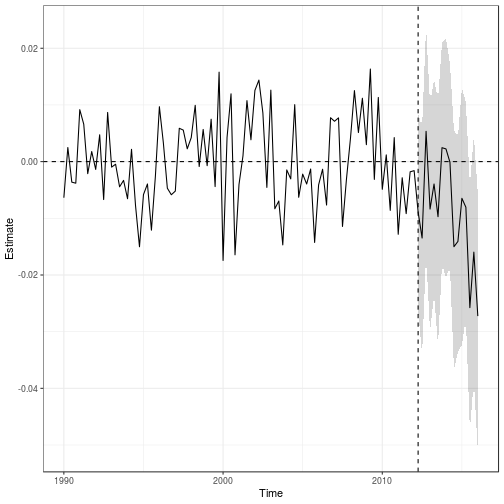
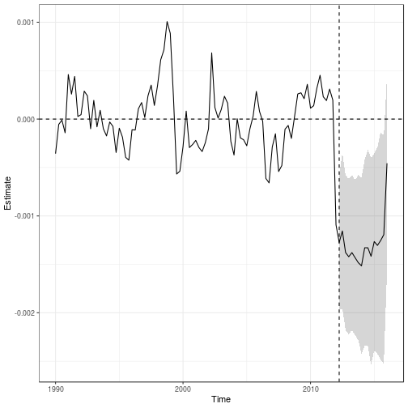
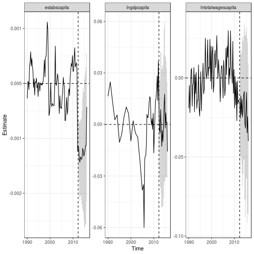
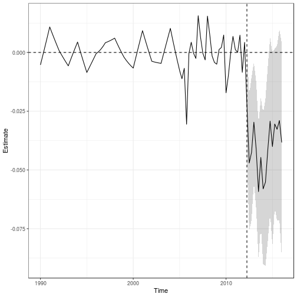
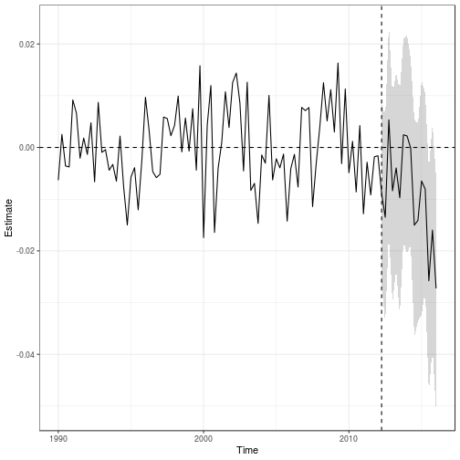
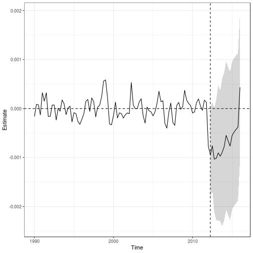
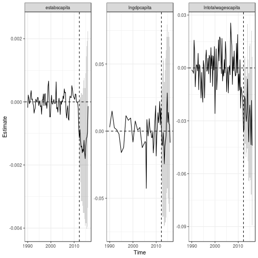

# `augsynth`: Estimating multiple outcome effects

### The data
To demonstrate `augsynth` with multiple outcomes, we'll use data on the impact of personal income tax cuts in Kansas that comes with the `AugSynth` package. Our interest is in estimating the effect of income tax cuts on gross state product (GSP) per capita, wages, establishment counts, and other macroeconomic indicators.


```r
library(magrittr)
library(dplyr)
library(augsynth)
data(kansas)
```

The `kansas` dataset contains the GSP per capita (the outcome measure) `lngdpcapita` for all 50 states from the first quarter of 1990 to the first quarter of 2016.

To run `augsynth`, we need to include a treatment status column that indicates which region was treated and at what time. The table in `kansas` contains the column `treated` to denote this. In the original study, the second quarter of 2012 was the implementation of the tax cut in Kansas.


```r
kansas %>% select(year, qtr, year_qtr, state, treated, gdp, lngdpcapita) %>% filter(state == "Kansas" & year_qtr >= 2012 & year_qtr < 2013) 
#> # A tibble: 4 x 7
#>    year   qtr year_qtr state  treated    gdp lngdpcapita
#>   <dbl> <dbl>    <dbl> <chr>    <dbl>  <dbl>       <dbl>
#> 1  2012     1    2012  Kansas       0 143844        10.8
#> 2  2012     2    2012. Kansas       1 141518        10.8
#> 3  2012     3    2012. Kansas       1 138890        10.8
#> 4  2012     4    2013. Kansas       1 139603        10.8
```


### Using the Synthetic Controls Method
We will begin by running the synthetic controls method on GDP per capita, wages, and the number of establishments. To run the vanilla synthetic controls method using `augsynth`, set `progfunc` to `None` and `scm` to `TRUE`.

#### Single outcomes
First, we will examine each outcome variable separately, beginning with log GDP per capita `lngdpcapita`.


```r
syn_lngdpcapita <- augsynth(lngdpcapita ~ treated, fips, year_qtr, kansas, progfunc="None", scm=T)
summary(syn_lngdpcapita)
#> 
#> Call:
#> single_augsynth(form = form, unit = !!enquo(unit), time = !!enquo(time), 
#>     t_int = t_int, data = data, progfunc = "None", scm = ..2)
#> 
#> Average ATT Estimate (Std. Error): -0.029  (0.032)
#> L2 Imbalance: 0.083
#> Scaled L2 Imbalance: 0.205
#> Percent improvement from uniform weights: 79.5%
#> Avg Estimated Bias: 0.000
#> 
#>     Time    Estimate  Std.Error
#>  2012.25 -0.01807275 0.02522761
#>  2012.50 -0.04105313 0.03005177
#>  2012.75 -0.03310023 0.02843157
#>  2013.00 -0.01940747 0.02380166
#>  2013.25 -0.02915453 0.02192548
#>  2013.50 -0.04626635 0.02652482
#>  2013.75 -0.03181209 0.02187922
#>  2014.00 -0.04476664 0.02783040
#>  2014.25 -0.04267269 0.03299546
#>  2014.50 -0.02940448 0.03382640
#>  2014.75 -0.01849616 0.03720388
#>  2015.00 -0.02930564 0.04226317
#>  2015.25 -0.01908377 0.03571756
#>  2015.50 -0.02162342 0.04012163
#>  2015.75 -0.01856676 0.04249425
#>  2016.00 -0.02816962 0.04896375
```


```r
plot(syn_lngdpcapita)
```


Next we will examine the log total wages per capita. Since this column doesn't already exist in the dataframe, we will create a `lntotalwagescapita` column.

```r
kansas$lntotalwagescapita <- log(kansas$totalwagescapita)
syn_lntotalwagescapita <- augsynth(lntotalwagescapita ~ treated, fips, year_qtr, kansas, progfunc="None", scm=T)
summary(syn_lntotalwagescapita)
#> 
#> Call:
#> single_augsynth(form = form, unit = !!enquo(unit), time = !!enquo(time), 
#>     t_int = t_int, data = data, progfunc = "None", scm = ..2)
#> 
#> Average ATT Estimate (Std. Error): -0.009  (0.006)
#> L2 Imbalance: 0.073
#> Scaled L2 Imbalance: 0.211
#> Percent improvement from uniform weights: 78.9%
#> Avg Estimated Bias: 0.000
#> 
#>     Time      Estimate   Std.Error
#>  2012.25 -0.0088788320 0.003746346
#>  2012.50 -0.0134820439 0.007948410
#>  2012.75  0.0053406487 0.008512342
#>  2013.00 -0.0083742197 0.005753301
#>  2013.25 -0.0039526954 0.005919130
#>  2013.50 -0.0097207960 0.009468572
#>  2013.75  0.0024556404 0.006460962
#>  2014.00  0.0022381965 0.006980271
#>  2014.25 -0.0001181258 0.005378017
#>  2014.50 -0.0150139482 0.007302291
#>  2014.75 -0.0140827665 0.006482037
#>  2015.00 -0.0064768723 0.008971568
#>  2015.25 -0.0080508889 0.008556768
#>  2015.50 -0.0257648197 0.009351365
#>  2015.75 -0.0159725100 0.012341230
#>  2016.00 -0.0272548622 0.012784014
```


```r
plot(syn_lntotalwagescapita)
```



Lastly, we will examine the number of establishments per capita, `estabscapita`.

```r
syn_estabscapita <- augsynth(estabscapita ~ treated, fips, year_qtr, kansas, progfunc="None", scm=T)
summary(syn_estabscapita)
#> 
#> Call:
#> single_augsynth(form = form, unit = !!enquo(unit), time = !!enquo(time), 
#>     t_int = t_int, data = data, progfunc = "None", scm = ..2)
#> 
#> Average ATT Estimate (Std. Error): -0.001  (0)
#> L2 Imbalance: 0.003
#> Scaled L2 Imbalance: 0.282
#> Percent improvement from uniform weights: 71.8%
#> Avg Estimated Bias: 0.000
#> 
#>     Time      Estimate    Std.Error
#>  2012.25 -0.0012733627 9.132672e-05
#>  2012.50 -0.0011555641 1.732084e-04
#>  2012.75 -0.0013777766 1.936398e-04
#>  2013.00 -0.0014214356 2.780134e-04
#>  2013.25 -0.0013789256 2.856448e-04
#>  2013.50 -0.0014316794 3.199253e-04
#>  2013.75 -0.0014831157 3.907868e-04
#>  2014.00 -0.0015153939 4.348300e-04
#>  2014.25 -0.0013290777 4.556452e-04
#>  2014.50 -0.0013291661 4.987701e-04
#>  2014.75 -0.0014164716 5.883750e-04
#>  2015.00 -0.0012648690 5.406990e-04
#>  2015.25 -0.0013046015 5.910107e-04
#>  2015.50 -0.0012545087 6.419896e-04
#>  2015.75 -0.0011928595 6.590545e-04
#>  2016.00 -0.0004562578 5.294541e-04
```


```r
plot(syn_estabscapita)
```



#### Multiple outcomes
Now we will combine our outcome variables into one study. To add more outcome variables, we add them to the LHS of the formula. 

```r
syn_multi <- augsynth(lngdpcapita + lntotalwagescapita + estabscapita ~ treated, fips, year_qtr, kansas, progfunc="None", scm=T)
summary(syn_multi)
#> 
#> Call:
#> augsynth_multiout(form = form, unit = !!enquo(unit), time = !!enquo(time), 
#>     t_int = t_int, data = data, progfunc = "None", scm = ..2)
#> 
#> Overall L2 Imbalance (Scaled):0.195  (0.367)
#> 
#> Average ATT Estimate:
#>              Outcome      Estimate    Std.Error     Pre.RMSE
#> 1        lngdpcapita  9.020282e-05 0.0158572193 0.0158311199
#> 2 lntotalwagescapita -2.131841e-02 0.0215200848 0.0133041191
#> 3       estabscapita -1.217106e-03 0.0004783142 0.0003848019
```


```r
plot(syn_multi)
```




### Using the Augmented Synthetic Controls Method
We will now repeat the study using the Augmented Synthetic Controls Method with ridge regression. In ASCM, we first fit the SCM weights, then combine it with a ridge regression, thus setting `progfunc="Ridge", scm=T`.


```r
asyn_lngdpcapita <- augsynth(lngdpcapita ~ treated, fips, year_qtr, kansas, progfunc="Ridge", scm=T)
summary(asyn_lngdpcapita)
#> 
#> Call:
#> single_augsynth(form = form, unit = !!enquo(unit), time = !!enquo(time), 
#>     t_int = t_int, data = data, progfunc = "Ridge", scm = ..2)
#> 
#> Average ATT Estimate (Std. Error): -0.040  (0.024)
#> L2 Imbalance: 0.062
#> Scaled L2 Imbalance: 0.153
#> Percent improvement from uniform weights: 84.7%
#> Avg Estimated Bias: 0.000
#> 
#>     Time    Estimate  Std.Error
#>  2012.25 -0.02233432 0.02085981
#>  2012.50 -0.04703842 0.02421257
#>  2012.75 -0.04252002 0.02117116
#>  2013.00 -0.02967474 0.01658453
#>  2013.25 -0.04119699 0.01645880
#>  2013.50 -0.05922698 0.01985558
#>  2013.75 -0.04466913 0.01714846
#>  2014.00 -0.05803598 0.02046732
#>  2014.25 -0.05516412 0.02538454
#>  2014.50 -0.04148561 0.02696688
#>  2014.75 -0.02923219 0.02973763
#>  2015.00 -0.04004239 0.03360558
#>  2015.25 -0.03045080 0.02705158
#>  2015.50 -0.03269061 0.03077540
#>  2015.75 -0.02895347 0.03251924
#>  2016.00 -0.03829085 0.03818993
```


```r
plot(asyn_lngdpcapita)
```




```r
asyn_lntotalwagescapita <- augsynth(lntotalwagescapita ~ treated, fips, year_qtr, kansas, progfunc="Ridge", scm=T)
summary(asyn_lntotalwagescapita)
#> 
#> Call:
#> single_augsynth(form = form, unit = !!enquo(unit), time = !!enquo(time), 
#>     t_int = t_int, data = data, progfunc = "Ridge", scm = ..2)
#> 
#> Average ATT Estimate (Std. Error): -0.009  (0.006)
#> L2 Imbalance: 0.073
#> Scaled L2 Imbalance: 0.211
#> Percent improvement from uniform weights: 78.9%
#> Avg Estimated Bias: 0.000
#> 
#>     Time      Estimate   Std.Error
#>  2012.25 -0.0088921839 0.003746781
#>  2012.50 -0.0134934461 0.007935041
#>  2012.75  0.0053234521 0.008485483
#>  2013.00 -0.0083857722 0.005761021
#>  2013.25 -0.0039669446 0.005909649
#>  2013.50 -0.0097338386 0.009447725
#>  2013.75  0.0024391889 0.006432159
#>  2014.00  0.0022241164 0.006985334
#>  2014.25 -0.0001343347 0.005408099
#>  2014.50 -0.0150298933 0.007303700
#>  2014.75 -0.0141015516 0.006495350
#>  2015.00 -0.0064927473 0.008972813
#>  2015.25 -0.0080652429 0.008568476
#>  2015.50 -0.0257771795 0.009350128
#>  2015.75 -0.0159869233 0.012347891
#>  2016.00 -0.0272659841 0.012786334
```


```r
plot(asyn_lntotalwagescapita)
```




```r
asyn_estabscapita <- augsynth(estabscapita ~ treated, fips, year_qtr, kansas, progfunc="Ridge", scm=T)
summary(asyn_estabscapita)
#> 
#> Call:
#> single_augsynth(form = form, unit = !!enquo(unit), time = !!enquo(time), 
#>     t_int = t_int, data = data, progfunc = "Ridge", scm = ..2)
#> 
#> Average ATT Estimate (Std. Error): -0.001  (0.001)
#> L2 Imbalance: 0.002
#> Scaled L2 Imbalance: 0.179
#> Percent improvement from uniform weights: 82.1%
#> Avg Estimated Bias: 0.000
#> 
#>     Time      Estimate    Std.Error
#>  2012.25 -0.0009439059 0.0003882333
#>  2012.50 -0.0007606866 0.0003779890
#>  2012.75 -0.0010329803 0.0004701837
#>  2013.00 -0.0010149995 0.0005841604
#>  2013.25 -0.0009043863 0.0006706299
#>  2013.50 -0.0009727514 0.0006392849
#>  2013.75 -0.0008929810 0.0007944379
#>  2014.00 -0.0007783632 0.0008910507
#>  2014.25 -0.0005474456 0.0009635388
#>  2014.50 -0.0006591233 0.0009354074
#>  2014.75 -0.0007652885 0.0010384931
#>  2015.00 -0.0005532327 0.0009651129
#>  2015.25 -0.0004797025 0.0010657672
#>  2015.50 -0.0004263724 0.0011140678
#>  2015.75 -0.0003769061 0.0011393132
#>  2016.00  0.0004343294 0.0010398111
```


```r
plot(asyn_estabscapita)
```



#### Multiple outcomes
Now we will combine our outcome variables into one study. To add more outcome variables, we add them to the LHS of the formula. 

```r
asyn_multi <- augsynth(lngdpcapita + lntotalwagescapita + estabscapita ~ treated, fips, year_qtr, kansas, progfunc="Ridge", scm=T)
summary(asyn_multi)
#> 
#> Call:
#> augsynth_multiout(form = form, unit = !!enquo(unit), time = !!enquo(time), 
#>     t_int = t_int, data = data, progfunc = "Ridge", scm = ..2)
#> 
#> Overall L2 Imbalance (Scaled):0.155  (0.292)
#> 
#> Average ATT Estimate:
#>              Outcome    Estimate    Std.Error     Pre.RMSE
#> 1        lngdpcapita -0.00641357 0.0151867949 0.0121956931
#> 2 lntotalwagescapita -0.02605305 0.0148995856 0.0110175269
#> 3       estabscapita -0.00144512 0.0003390969 0.0003104172
```


```r
plot(asyn_multi)
```


