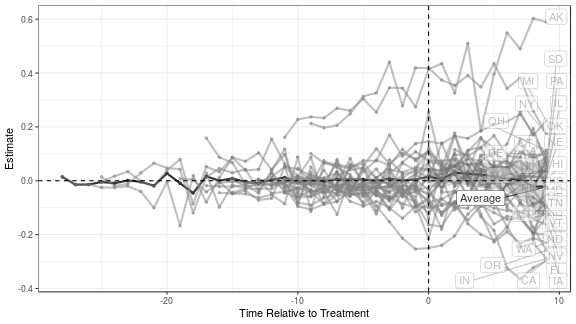
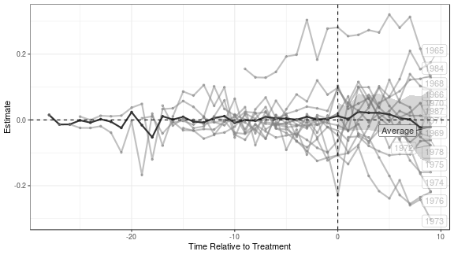
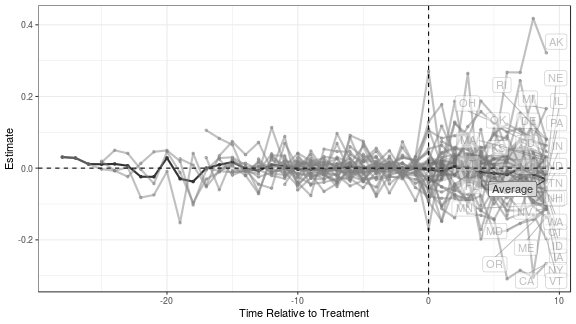
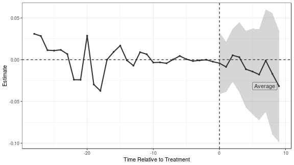
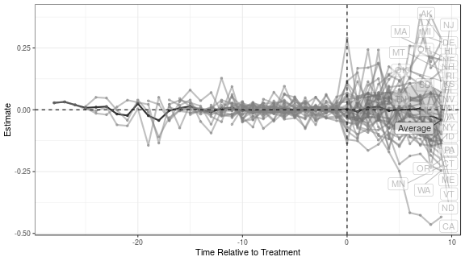

# `augsynth`: Estimating treatment effects with staggered adoption

### The data

To show the features of the `multisynth` function we will use data on the effects of states implementing mandatory collective bargaining agreements for public sector unions [(Paglayan, 2018)](https://onlinelibrary.wiley.com/doi/full/10.1111/ajps.12388)


```r
library(magrittr)
library(dplyr)
library(augsynth)
```


```r
data <- read.csv("https://dataverse.harvard.edu/api/access/datafile/:persistentId?persistentId=doi:10.7910/DVN/WGWMAV/3UHTLP", sep="\t")
```

The dataset contains several important variables that we'll use:

- `year`, `State`: The state and year of the measurement
- `YearCBrequired`: The year that the state adopted mandatory collective bargaining
- `lnppexpend`: Log per pupil expenditures in constant 2010 $

<table class="table table-hover table-responsive" style="margin-left: auto; margin-right: auto;">
 <thead>
  <tr>
   <th style="text-align:right;"> year </th>
   <th style="text-align:left;"> State </th>
   <th style="text-align:right;"> YearCBrequired </th>
   <th style="text-align:right;"> lnppexpend </th>
  </tr>
 </thead>
<tbody>
  <tr>
   <td style="text-align:right;"> 1960 </td>
   <td style="text-align:left;"> AK </td>
   <td style="text-align:right;"> 1970 </td>
   <td style="text-align:right;"> 8.325518 </td>
  </tr>
  <tr>
   <td style="text-align:right;"> 1960 </td>
   <td style="text-align:left;"> AL </td>
   <td style="text-align:right;"> NA </td>
   <td style="text-align:right;"> 7.396177 </td>
  </tr>
  <tr>
   <td style="text-align:right;"> 1960 </td>
   <td style="text-align:left;"> AR </td>
   <td style="text-align:right;"> NA </td>
   <td style="text-align:right;"> 7.385373 </td>
  </tr>
  <tr>
   <td style="text-align:right;"> 1960 </td>
   <td style="text-align:left;"> AZ </td>
   <td style="text-align:right;"> NA </td>
   <td style="text-align:right;"> 7.947127 </td>
  </tr>
  <tr>
   <td style="text-align:right;"> 1960 </td>
   <td style="text-align:left;"> CA </td>
   <td style="text-align:right;"> 1976 </td>
   <td style="text-align:right;"> 8.185162 </td>
  </tr>
  <tr>
   <td style="text-align:right;"> 1960 </td>
   <td style="text-align:left;"> CO </td>
   <td style="text-align:right;"> NA </td>
   <td style="text-align:right;"> 7.952833 </td>
  </tr>
</tbody>
</table>

To run `multisynth`, we need to include a treatment status column that indicates which state is treated in a given year, we call this `cbr` below. We also restrict to the years 1959-1997 where we have yearly measurements of expenditures and drop Washington D.C. and Wisconsin from the analysis.


```r
data %>%
    filter(!State %in% c("DC", "WI"),
           year >= 1959, year <= 1997) %>%
    mutate(YearCBrequired = ifelse(is.na(YearCBrequired), 
                                   Inf, YearCBrequired),
           cbr = 1 * (year >= YearCBrequired)) -> analysis_df
```

## Partially pooled SCM

To fit partially pooled synthetic controls, we need to give `multisynth` a formula of the form `outcome ~ treatment`, point it to the unit and time variables, and choose the level of partial pooling `nu`. Setting `nu = 0` fits a separate synthetic control for each treated unit and setting `nu = 1` fits fully pooled synthetic controls. If we don't set `nu`, `multisynth` will choose a heuristic value based on how well separate synthetic controls balance the overall average. We can also set the number of post-treatment time periods (leads) that we want to estimate with the `n_leads` argument (by default `multisynth` uses the number of post-treatment periods for the last treated unit).


```r
# with a choice of nu
ppool_syn <- multisynth(lnppexpend ~ cbr, State, year, 
                        nu = 0.5, analysis_df, n_leads = 10)
# with default nu
ppool_syn <- multisynth(lnppexpend ~ cbr, State, year, 
                        analysis_df, n_leads = 10)

print(ppool_syn$nu)
#> [1] 0.441631

ppool_syn
#> 
#> Call:
#> multisynth(form = lnppexpend ~ cbr, unit = State, time = year, 
#>     data = analysis_df, n_leads = 10)
#> 
#> Average ATT Estimate: 0.008
```

Using the `summary` function, we'll compute the treatment effects and jackknife standard errors for all treated units as well as the average. (This takes a bit of time so we'll store the output)


```r
ppool_syn_summ <- summary(ppool_syn)
```

We can then report the level of global and individual balance as well as estimates for the average.


```r
ppool_syn_summ
#> 
#> Call:
#> multisynth(form = lnppexpend ~ cbr, unit = State, time = year, 
#>     data = analysis_df, n_leads = 10)
#> 
#> Average ATT Estimate (Std. Error): 0.008  (0.018)
#> 
#> Global L2 Imbalance: 0.596
#> Scaled Global L2 Imbalance: 0.026
#> Percent improvement from uniform global weights: 97.4
#> 
#> Individual L2 Imbalance: 7.307
#> Scaled Individual L2 Imbalance: 0.258
#> Percent improvement from uniform individual weights: 74.2	
#> 
#>  Time Since Treatment   Level     Estimate  Std.Error
#>                     0 Average  0.015171897 0.01815363
#>                     1 Average  0.006308739 0.01758706
#>                     2 Average  0.030349346 0.02125224
#>                     3 Average  0.025168950 0.02081810
#>                     4 Average  0.022922181 0.02514937
#>                     5 Average  0.015809701 0.02273569
#>                     6 Average  0.005126407 0.02343249
#>                     7 Average  0.005279356 0.03601689
#>                     8 Average -0.020390421 0.04153982
#>                     9 Average -0.021103498 0.05620688
```

`nopool_syn_summ$att` is a dataframe that contains all of the point estimates and standard errors. `Time = NA` denotes the effect averaged across the post treatment periods.

<table class="table table-hover table-responsive" style="margin-left: auto; margin-right: auto;">
 <thead>
  <tr>
   <th style="text-align:right;"> Time </th>
   <th style="text-align:left;"> Level </th>
   <th style="text-align:right;"> Estimate </th>
   <th style="text-align:right;"> Std.Error </th>
  </tr>
 </thead>
<tbody>
  <tr>
   <td style="text-align:right;"> 0 </td>
   <td style="text-align:left;"> Average </td>
   <td style="text-align:right;"> 0.0151719 </td>
   <td style="text-align:right;"> 0.0181536 </td>
  </tr>
  <tr>
   <td style="text-align:right;"> 1 </td>
   <td style="text-align:left;"> Average </td>
   <td style="text-align:right;"> 0.0063087 </td>
   <td style="text-align:right;"> 0.0175871 </td>
  </tr>
  <tr>
   <td style="text-align:right;"> 2 </td>
   <td style="text-align:left;"> Average </td>
   <td style="text-align:right;"> 0.0303493 </td>
   <td style="text-align:right;"> 0.0212522 </td>
  </tr>
  <tr>
   <td style="text-align:right;"> 3 </td>
   <td style="text-align:left;"> Average </td>
   <td style="text-align:right;"> 0.0251689 </td>
   <td style="text-align:right;"> 0.0208181 </td>
  </tr>
  <tr>
   <td style="text-align:right;"> 4 </td>
   <td style="text-align:left;"> Average </td>
   <td style="text-align:right;"> 0.0229222 </td>
   <td style="text-align:right;"> 0.0251494 </td>
  </tr>
  <tr>
   <td style="text-align:right;"> 5 </td>
   <td style="text-align:left;"> Average </td>
   <td style="text-align:right;"> 0.0158097 </td>
   <td style="text-align:right;"> 0.0227357 </td>
  </tr>
</tbody>
</table>

We can also visually display both the pre-treatment balance and the estimated treatment effects.


```r
plot(ppool_syn_summ)
```



And again we can hone in on the average effects.


```r
plot(ppool_syn_summ, levels = "Average")
```


We can also collapse treated units with the same treatment time into _time cohorts_, and find one synthetic control per time cohort by setting `time_cohort = TRUE`. When the number of distinct treatment times is much smaller than the number of treated units, this will run significantly faster.


```r
# with default nu
ppool_syn_time <- multisynth(lnppexpend ~ cbr, State, year,
                        analysis_df, n_leads = 10, time_cohort = TRUE)

print(ppool_syn_time$nu)
#> [1] 0.4568765

ppool_syn_time
#> 
#> Call:
#> multisynth(form = lnppexpend ~ cbr, unit = State, time = year, 
#>     data = analysis_df, n_leads = 10, time_cohort = TRUE)
#> 
#> Average ATT Estimate: 0.006
```

We can then compute effects for the overall average as well as for each treatment time cohort, rather than individual units.


```r
ppool_syn_time_summ <- summary(ppool_syn_time)
ppool_syn_time_summ
#> 
#> Call:
#> multisynth(form = lnppexpend ~ cbr, unit = State, time = year, 
#>     data = analysis_df, n_leads = 10, time_cohort = TRUE)
#> 
#> Average ATT Estimate (Std. Error): 0.006  (0.019)
#> 
#> Global L2 Imbalance: 0.664
#> Scaled Global L2 Imbalance: 0.029
#> Percent improvement from uniform global weights: 97.1
#> 
#> Individual L2 Imbalance: 4.742
#> Scaled Individual L2 Imbalance: 0.174
#> Percent improvement from uniform individual weights: 82.6	
#> 
#>  Time Since Treatment   Level     Estimate  Std.Error
#>                     0 Average  0.011713185 0.02001232
#>                     1 Average  0.002933446 0.01865073
#>                     2 Average  0.024635797 0.02745413
#>                     3 Average  0.021627703 0.02591711
#>                     4 Average  0.021595029 0.02926688
#>                     5 Average  0.016765877 0.02503296
#>                     6 Average  0.005618898 0.02581584
#>                     7 Average  0.001481569 0.03703330
#>                     8 Average -0.022920233 0.04727541
#>                     9 Average -0.021720484 0.05576624
```

<table class="table table-hover table-responsive" style="margin-left: auto; margin-right: auto;">
 <thead>
  <tr>
   <th style="text-align:right;"> Time </th>
   <th style="text-align:left;"> Level </th>
   <th style="text-align:right;"> Estimate </th>
   <th style="text-align:right;"> Std.Error </th>
  </tr>
 </thead>
<tbody>
  <tr>
   <td style="text-align:right;"> 0 </td>
   <td style="text-align:left;"> Average </td>
   <td style="text-align:right;"> 0.0117132 </td>
   <td style="text-align:right;"> 0.0200123 </td>
  </tr>
  <tr>
   <td style="text-align:right;"> 1 </td>
   <td style="text-align:left;"> Average </td>
   <td style="text-align:right;"> 0.0029334 </td>
   <td style="text-align:right;"> 0.0186507 </td>
  </tr>
  <tr>
   <td style="text-align:right;"> 2 </td>
   <td style="text-align:left;"> Average </td>
   <td style="text-align:right;"> 0.0246358 </td>
   <td style="text-align:right;"> 0.0274541 </td>
  </tr>
  <tr>
   <td style="text-align:right;"> 3 </td>
   <td style="text-align:left;"> Average </td>
   <td style="text-align:right;"> 0.0216277 </td>
   <td style="text-align:right;"> 0.0259171 </td>
  </tr>
  <tr>
   <td style="text-align:right;"> 4 </td>
   <td style="text-align:left;"> Average </td>
   <td style="text-align:right;"> 0.0215950 </td>
   <td style="text-align:right;"> 0.0292669 </td>
  </tr>
  <tr>
   <td style="text-align:right;"> 5 </td>
   <td style="text-align:left;"> Average </td>
   <td style="text-align:right;"> 0.0167659 </td>
   <td style="text-align:right;"> 0.0250330 </td>
  </tr>
</tbody>
</table>

Again we can plot the effects.


```r
plot(ppool_syn_time_summ)
```




## Combining with outcome modeling

### Weighted event studies
There is particularly bad pre-treatment fit for a few states, so we can augment the synthetic controls estimates with outcome modeling to adjust for the poor fit. A simple form of augmentation combines the synth estimates with a unit fixed effects model, removing the pre-treatment averages for each state and fitting partially pooled SCM after de-meaning. To do this with `multisynth` we set `fixedeff = T`.


```r
wevent <- multisynth(lnppexpend ~ cbr, State, year, 
                        analysis_df, n_leads = 10, fixedeff = T)

print(wevent$nu)
#> [1] 0.2618261

wevent
#> 
#> Call:
#> multisynth(form = lnppexpend ~ cbr, unit = State, time = year, 
#>     data = analysis_df, n_leads = 10, fixedeff = T)
#> 
#> Average ATT Estimate: -0.010
```

We can again get jackknife standard error estimates to go along with our point estimates, and inspect the results. We see that we get much better pre-treatment fit by explciitly accounting for pre-treatment averages.


```r
wevent_summ <- summary(wevent)
```


```r
wevent_summ
#> 
#> Call:
#> multisynth(form = lnppexpend ~ cbr, unit = State, time = year, 
#>     data = analysis_df, n_leads = 10, fixedeff = T)
#> 
#> Average ATT Estimate (Std. Error): -0.010  (0.019)
#> 
#> Global L2 Imbalance: 0.459
#> Scaled Global L2 Imbalance: 0.020
#> Percent improvement from uniform global weights: 98
#> 
#> Individual L2 Imbalance: 3.031
#> Scaled Individual L2 Imbalance: 0.107
#> Percent improvement from uniform individual weights: 89.3	
#> 
#>  Time Since Treatment   Level      Estimate  Std.Error
#>                     0 Average -0.0042423607 0.01850490
#>                     1 Average -0.0084540832 0.01503804
#>                     2 Average  0.0049970516 0.01588945
#>                     3 Average  0.0033221621 0.02083404
#>                     4 Average -0.0114457271 0.02290526
#>                     5 Average -0.0139463272 0.02543768
#>                     6 Average -0.0176520776 0.02711052
#>                     7 Average -0.0005477864 0.03059846
#>                     8 Average -0.0168384303 0.03632264
#>                     9 Average -0.0317446441 0.03317117
```


```r
plot(wevent_summ)
```




```r
plot(wevent_summ, levels = "Average")
```




### Augmenting with other outcome models

We can also augment the partially pooled SCM estimates by directly fitting a factor model with [`gsynth`](https://cran.r-project.org/web/packages/gsynth/gsynth.pdf). To do this, we can set the `n_factors` argument to be the number of factors we want to estimate. By default, `n_factors = 0`, which combined with `fixedeff = T` gives the weighted event study above. (Setting `n_factors = NULL` chooses the number of factors via cross validation, but will not work on this dataset because of certain hardcoded parameters in `gsynth`.)


```r
scm_gsyn <- multisynth(lnppexpend ~ cbr, State, year,
                        analysis_df, n_leads = 10, 
                        fixedeff = T, n_factors = 2)

scm_gsyn
#> 
#> Call:
#> multisynth(form = lnppexpend ~ cbr, unit = State, time = year, 
#>     data = analysis_df, n_leads = 10, fixedeff = T, n_factors = 2)
#> 
#> Average ATT Estimate: -0.005
```


```r
scm_gsyn_summ <- summary(scm_gsyn)

scm_gsyn_summ
#> 
#> Call:
#> multisynth(form = lnppexpend ~ cbr, unit = State, time = year, 
#>     data = analysis_df, n_leads = 10, fixedeff = T, n_factors = 2)
#> 
#> Average ATT Estimate (Std. Error): -0.005  (0.036)
#> 
#> Global L2 Imbalance: 0.427
#> Scaled Global L2 Imbalance: 0.019
#> Percent improvement from uniform global weights: 98.1
#> 
#> Individual L2 Imbalance: 2.781
#> Scaled Individual L2 Imbalance: 0.098
#> Percent improvement from uniform individual weights: 90.2	
#> 
#>  Time Since Treatment   Level      Estimate  Std.Error
#>                     0 Average  3.287948e-03 0.01940586
#>                     1 Average -8.276454e-03 0.01846108
#>                     2 Average  8.559703e-03 0.03211634
#>                     3 Average  1.270920e-02 0.02949293
#>                     4 Average -3.686049e-03 0.03734294
#>                     5 Average  1.737698e-06 0.04139452
#>                     6 Average  8.167464e-04 0.04680032
#>                     7 Average  4.897136e-03 0.05656057
#>                     8 Average -2.434396e-02 0.06042270
#>                     9 Average -4.108417e-02 0.05919461
```


```r
plot(scm_gsyn_summ, level="Average")
```




More augmentation methods to come!
