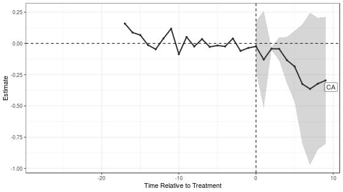
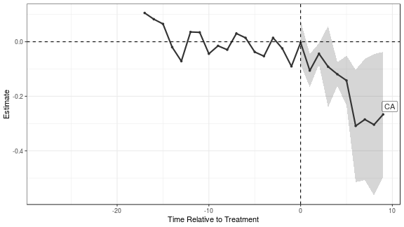

# `augsynth`: Estimating treatment effects with staggered adoption

### The data

To show the features of the `multisynth` function we will use data on the effects of states implementing mandatory collective bargaining agreements for public sector unions [(Paglayan, 2018)](https://onlinelibrary.wiley.com/doi/full/10.1111/ajps.12388)


```r
library(magrittr)
library(dplyr)
library(augsynth)
```


```r
data <- read.csv("https://dataverse.harvard.edu/api/access/datafile/:persistentId?persistentId=doi:10.7910/DVN/WGWMAV/3UHTLP", sep="\t")
```

The dataset contains several important variables that we'll use:

- `year`, `State`: The state and year of the measurement
- `YearCBrequired`: The year that the state adopted mandatory collective bargaining
- `lnppexpend`: Log per pupil expenditures in constant 2010 $

<table class="table table-hover table-responsive" style="margin-left: auto; margin-right: auto;">
 <thead>
  <tr>
   <th style="text-align:right;"> year </th>
   <th style="text-align:left;"> State </th>
   <th style="text-align:right;"> YearCBrequired </th>
   <th style="text-align:right;"> lnppexpend </th>
  </tr>
 </thead>
<tbody>
  <tr>
   <td style="text-align:right;"> 1960 </td>
   <td style="text-align:left;"> AK </td>
   <td style="text-align:right;"> 1970 </td>
   <td style="text-align:right;"> 8.325518 </td>
  </tr>
  <tr>
   <td style="text-align:right;"> 1960 </td>
   <td style="text-align:left;"> AL </td>
   <td style="text-align:right;"> NA </td>
   <td style="text-align:right;"> 7.396177 </td>
  </tr>
  <tr>
   <td style="text-align:right;"> 1960 </td>
   <td style="text-align:left;"> AR </td>
   <td style="text-align:right;"> NA </td>
   <td style="text-align:right;"> 7.385373 </td>
  </tr>
  <tr>
   <td style="text-align:right;"> 1960 </td>
   <td style="text-align:left;"> AZ </td>
   <td style="text-align:right;"> NA </td>
   <td style="text-align:right;"> 7.947127 </td>
  </tr>
  <tr>
   <td style="text-align:right;"> 1960 </td>
   <td style="text-align:left;"> CA </td>
   <td style="text-align:right;"> 1976 </td>
   <td style="text-align:right;"> 8.185162 </td>
  </tr>
  <tr>
   <td style="text-align:right;"> 1960 </td>
   <td style="text-align:left;"> CO </td>
   <td style="text-align:right;"> NA </td>
   <td style="text-align:right;"> 7.952833 </td>
  </tr>
</tbody>
</table>

To run `multisynth`, we need to include a treatment status column that indicates which state is treated in a given year, we call this `cbr` below. We also restrict to the years 1959-1997 where we have yearly measurements of expenditures and drop Washington D.C. and Wisconsin from the analysis.


```r
data %>%
    filter(!State %in% c("DC", "WI"),
           year >= 1959, year <= 1997) %>%
    mutate(YearCBrequired = ifelse(is.na(YearCBrequired), 
                                   Inf, YearCBrequired),
           cbr = 1 * (year >= YearCBrequired)) -> analysis_df
```

## Partially pooled SCM

To fit partially pooled synthetic controls, we need to give `multisynth` a formula of the form `outcome ~ treatment`, point it to the unit and time variables, and choose the level of partial pooling `nu`. Setting `nu = 0` fits a separate synthetic control for each treated unit and setting `nu = 1` fits fully pooled synthetic controls. If we don't set `nu`, `multisynth` will choose a heuristic value based on how well separate synthetic controls balance the overall average. We can also set the number of post-treatment time periods (leads) that we want to estimate with the `n_leads` argument (by default `multisynth` uses the number of post-treatment periods for the last treated unit).


```r
# with a choice of nu
ppool_syn <- multisynth(lnppexpend ~ cbr, State, year, 
                        nu = 0.5, analysis_df, n_leads = 10)
# with default nu
ppool_syn <- multisynth(lnppexpend ~ cbr, State, year, 
                        analysis_df, n_leads = 10)

print(ppool_syn$nu)
#> [1] 0.4414164

ppool_syn
#> 
#> Call:
#> multisynth(form = lnppexpend ~ cbr, unit = State, time = year, 
#>     data = analysis_df, n_leads = 10)
#> 
#> Average ATT Estimate: 0.008
```

Using the `summary` function, we'll compute the treatment effects and jackknife standard errors for all treated units as well as the average. (This takes a bit of time so we'll store the output)


```r
ppool_syn_summ <- summary(ppool_syn)
```

We can then report the level of global and individual balance as well as estimates for the average.


```r
ppool_syn_summ
#> 
#> Call:
#> multisynth(form = lnppexpend ~ cbr, unit = State, time = year, 
#>     data = analysis_df, n_leads = 10)
#> 
#> Global L2 Imbalance (Scaled): 0.592  (0.026)
#> 
#> Individual L2 Imbalance (Scaled): 7.306  (0.258)	
#> 
#> Average ATT Estimate (Std. Error): 0.008  (0.019)
#> 
#>  Time Since Treatment   Level     Estimate  Std.Error
#>                     0 Average  0.015383146 0.01833977
#>                     1 Average  0.006146529 0.01748648
#>                     2 Average  0.030249213 0.02084475
#>                     3 Average  0.025387275 0.02037887
#>                     4 Average  0.022623449 0.02483946
#>                     5 Average  0.016170989 0.02255253
#>                     6 Average  0.005542375 0.02340480
#>                     7 Average  0.005257088 0.03670321
#>                     8 Average -0.021308099 0.04303078
#>                     9 Average -0.021635036 0.05789247
```

To look at the effects for any particular treated unit we can use the `level` argument when printing.


```r
print(ppool_syn_summ, level = "CA")
#> 
#> Call:
#> multisynth(form = lnppexpend ~ cbr, unit = State, time = year, 
#>     data = analysis_df, n_leads = 10)
#> 
#> Global L2 Imbalance (Scaled): 0.592  (0.026)
#> 
#> Individual L2 Imbalance (Scaled): 7.306  (0.258)	
#> 
#> Average ATT Estimate (Std. Error): -0.187  (0.163)
#> 
#>  Time Since Treatment Level    Estimate   Std.Error
#>                     0    CA -0.02421824 0.101831542
#>                     1    CA -0.12907169 0.194389433
#>                     2    CA -0.04250841 0.005700984
#>                     3    CA -0.04362661 0.046207862
#>                     4    CA -0.13379304 0.092830551
#>                     5    CA -0.18439048 0.142258741
#>                     6    CA -0.32433709 0.238914906
#>                     7    CA -0.36420025 0.305176301
#>                     8    CA -0.32250605 0.263482340
#>                     9    CA -0.29649894 0.254567309
```

`nopool_syn_summ$att` is a dataframe that contains all of the point estimates and standard errors. `Time = NA` denotes the effect averaged across the post treatment periods.

<table class="table table-hover table-responsive" style="margin-left: auto; margin-right: auto;">
 <thead>
  <tr>
   <th style="text-align:right;"> Time </th>
   <th style="text-align:left;"> Level </th>
   <th style="text-align:right;"> Estimate </th>
   <th style="text-align:right;"> Std.Error </th>
  </tr>
 </thead>
<tbody>
  <tr>
   <td style="text-align:right;"> NA </td>
   <td style="text-align:left;"> Average </td>
   <td style="text-align:right;"> 0.0083817 </td>
   <td style="text-align:right;"> 0.0185505 </td>
  </tr>
  <tr>
   <td style="text-align:right;"> NA </td>
   <td style="text-align:left;"> AK </td>
   <td style="text-align:right;"> 0.4495833 </td>
   <td style="text-align:right;"> 0.0063126 </td>
  </tr>
  <tr>
   <td style="text-align:right;"> NA </td>
   <td style="text-align:left;"> CA </td>
   <td style="text-align:right;"> -0.1865151 </td>
   <td style="text-align:right;"> 0.1633960 </td>
  </tr>
  <tr>
   <td style="text-align:right;"> NA </td>
   <td style="text-align:left;"> CT </td>
   <td style="text-align:right;"> 0.0858286 </td>
   <td style="text-align:right;"> 0.0153421 </td>
  </tr>
  <tr>
   <td style="text-align:right;"> NA </td>
   <td style="text-align:left;"> DE </td>
   <td style="text-align:right;"> 0.0529548 </td>
   <td style="text-align:right;"> 0.0054863 </td>
  </tr>
  <tr>
   <td style="text-align:right;"> NA </td>
   <td style="text-align:left;"> FL </td>
   <td style="text-align:right;"> -0.0340118 </td>
   <td style="text-align:right;"> 0.0383583 </td>
  </tr>
</tbody>
</table>

We can also visually display both the pre-treatment balance and the estimated treatment effects.


```r
plot(ppool_syn_summ)
```


And again we can hone in on the average effects or the effects for a particular state.


```r
plot(ppool_syn_summ, level = "Average")
```


```r
plot(ppool_syn_summ, level = "CA")
```




## Combining with outcome modeling

### Weighted event studies
There is particularly bad pre-treatment fit for a few states, so we can augment the synthetic controls estimates with outcome modeling to adjust for the poor fit. A simple form of augmentation combines the synth estimates with a unit fixed effects model, removing the pre-treatment averages for each state and fitting partially pooled SCM after de-meaning. To do this with `multisynth` we set `fixedeff = T`.


```r
wevent <- multisynth(lnppexpend ~ cbr, State, year, 
                        analysis_df, n_leads = 10, fixedeff = T)

print(wevent$nu)
#> [1] 0.2618332

wevent
#> 
#> Call:
#> multisynth(form = lnppexpend ~ cbr, unit = State, time = year, 
#>     data = analysis_df, n_leads = 10, fixedeff = T)
#> 
#> Average ATT Estimate: -0.010
```

We can again get jackknife standard error estimates to go along with our point estimates, and inspect the results overall and for individual states. We see that we get much better pre-treatment fit by explciitly accounting for pre-treatment averages.


```r
wevent_summ <- summary(wevent)
```


```r
wevent_summ
#> 
#> Call:
#> multisynth(form = lnppexpend ~ cbr, unit = State, time = year, 
#>     data = analysis_df, n_leads = 10, fixedeff = T)
#> 
#> Global L2 Imbalance (Scaled): 0.459  (0.020)
#> 
#> Individual L2 Imbalance (Scaled): 3.031  (0.107)	
#> 
#> Average ATT Estimate (Std. Error): -0.010  (0.019)
#> 
#>  Time Since Treatment   Level     Estimate  Std.Error
#>                     0 Average -0.004207602 0.01853892
#>                     1 Average -0.008626301 0.01504224
#>                     2 Average  0.005190630 0.01598220
#>                     3 Average  0.003057109 0.02090243
#>                     4 Average -0.011462587 0.02303201
#>                     5 Average -0.014255201 0.02567189
#>                     6 Average -0.017846680 0.02729040
#>                     7 Average -0.001045376 0.03073247
#>                     8 Average -0.016913989 0.03635174
#>                     9 Average -0.031740279 0.03352987
```


```r
print(wevent_summ, level = "CA")
#> 
#> Call:
#> multisynth(form = lnppexpend ~ cbr, unit = State, time = year, 
#>     data = analysis_df, n_leads = 10, fixedeff = T)
#> 
#> Global L2 Imbalance (Scaled): 0.459  (0.020)
#> 
#> Individual L2 Imbalance (Scaled): 3.031  (0.107)	
#> 
#> Average ATT Estimate (Std. Error): -0.167  (0.060)
#> 
#>  Time Since Treatment Level     Estimate  Std.Error
#>                     0    CA -0.002911185 0.04030874
#>                     1    CA -0.105742559 0.03031279
#>                     2    CA -0.043717771 0.01922202
#>                     3    CA -0.091575887 0.07454688
#>                     4    CA -0.119009810 0.02173724
#>                     5    CA -0.141947210 0.04536524
#>                     6    CA -0.308835658 0.10313276
#>                     7    CA -0.285059662 0.11120082
#>                     8    CA -0.304295172 0.12964322
#>                     9    CA -0.266500523 0.11466658
```


```r
plot(wevent_summ)
```


```r
plot(wevent_summ, level = "Average")
```


```r
plot(wevent_summ, level = "CA")
```




### Augmenting with other outcome models

We can also augment the partially pooled SCM estimates by directly fitting a factor model with [`gsynth`](https://cran.r-project.org/web/packages/gsynth/gsynth.pdf). To do this, we can set the `n_factors` argument to be the number of factors we want to estimate. By default, `n_factors = 0`, which combined with `fixedeff = T` gives the weighted event study above. (`n_factors = NULL` chooses the number of factors via cross validation)


```r
scm_gsyn <- multisynth(lnppexpend ~ cbr, State, year,
                        analysis_df, n_leads = 10, 
                        fixedeff = T, n_factors = NULL)

# number of factors
print(ncol(scm_gsyn$params$factor))
#> [1] 2

scm_gsyn
#> 
#> Call:
#> multisynth(form = lnppexpend ~ cbr, unit = State, time = year, 
#>     data = analysis_df, n_leads = 10, fixedeff = T, n_factors = NULL)
#> 
#> Average ATT Estimate: -0.005
```


```r
scm_gsyn_summ <- summary(scm_gsyn)

scm_gsyn_summ
#> 
#> Call:
#> multisynth(form = lnppexpend ~ cbr, unit = State, time = year, 
#>     data = analysis_df, n_leads = 10, fixedeff = T, n_factors = NULL)
#> 
#> Global L2 Imbalance (Scaled): 0.427  (0.019)
#> 
#> Individual L2 Imbalance (Scaled): 2.782  (0.098)	
#> 
#> Average ATT Estimate (Std. Error): -0.005  (0.019)
#> 
#>  Time Since Treatment   Level      Estimate  Std.Error
#>                     0 Average  3.295537e-03 0.01851129
#>                     1 Average -8.080488e-03 0.01528748
#>                     2 Average  8.749617e-03 0.01563655
#>                     3 Average  1.283153e-02 0.02089142
#>                     4 Average -3.291577e-03 0.02302410
#>                     5 Average -8.517862e-05 0.02587494
#>                     6 Average  3.864059e-04 0.02747050
#>                     7 Average  4.638853e-03 0.03073413
#>                     8 Average -2.457526e-02 0.03619280
#>                     9 Average -4.135163e-02 0.03351201
```


```r
plot(scm_gsyn_summ, level="Average")
```


More augmentation methods to come!
