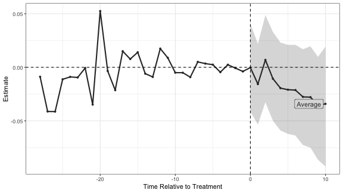

# `augsynth`: Estimating treatment effects with staggered adoption

### The data

To show the features of the `multisynth` function we will use data on the effects of states implementing mandatory collective bargaining agreements for public sector unions [(Paglayan, 2018)](https://onlinelibrary.wiley.com/doi/full/10.1111/ajps.12388)


```r
library(magrittr)
library(dplyr)
library(augsynth)
```


```r
data <- read.csv("https://dataverse.harvard.edu/api/access/datafile/:persistentId?persistentId=doi:10.7910/DVN/WGWMAV/3UHTLP", sep="\t")
```

The dataset contains several important variables that we'll use:

- `year`, `State`: The state and year of the measurement
- `YearCBrequired`: The year that the state adopted mandatory collective bargaining
- `lnppexpend`: Log per pupil expenditures in constant 2010 $

<table class="table table-hover table-responsive" style="margin-left: auto; margin-right: auto;">
 <thead>
  <tr>
   <th style="text-align:right;"> year </th>
   <th style="text-align:left;"> State </th>
   <th style="text-align:right;"> YearCBrequired </th>
   <th style="text-align:right;"> lnppexpend </th>
  </tr>
 </thead>
<tbody>
  <tr>
   <td style="text-align:right;"> 1960 </td>
   <td style="text-align:left;"> AK </td>
   <td style="text-align:right;"> 1970 </td>
   <td style="text-align:right;"> 8.325518 </td>
  </tr>
  <tr>
   <td style="text-align:right;"> 1960 </td>
   <td style="text-align:left;"> AL </td>
   <td style="text-align:right;"> NA </td>
   <td style="text-align:right;"> 7.396177 </td>
  </tr>
  <tr>
   <td style="text-align:right;"> 1960 </td>
   <td style="text-align:left;"> AR </td>
   <td style="text-align:right;"> NA </td>
   <td style="text-align:right;"> 7.385373 </td>
  </tr>
  <tr>
   <td style="text-align:right;"> 1960 </td>
   <td style="text-align:left;"> AZ </td>
   <td style="text-align:right;"> NA </td>
   <td style="text-align:right;"> 7.947127 </td>
  </tr>
  <tr>
   <td style="text-align:right;"> 1960 </td>
   <td style="text-align:left;"> CA </td>
   <td style="text-align:right;"> 1976 </td>
   <td style="text-align:right;"> 8.185162 </td>
  </tr>
  <tr>
   <td style="text-align:right;"> 1960 </td>
   <td style="text-align:left;"> CO </td>
   <td style="text-align:right;"> NA </td>
   <td style="text-align:right;"> 7.952833 </td>
  </tr>
</tbody>
</table>

To run `multisynth`, we need to include a treatment status column that indicates which state is treated in a given year, we call this `cbr` below. We also restrict to the years 1959-1997 where we have yearly measurements of expenditures and drop Washington D.C. and Wisconsin from the analysis.


```r
data %>%
    filter(!State %in% c("DC", "WI"),
           year >= 1959, year <= 1997) %>%
    mutate(YearCBrequired = ifelse(is.na(YearCBrequired), 
                                   Inf, YearCBrequired),
           cbr = 1 * (year >= YearCBrequired)) -> analysis_df
```

## Partially pooled SCM with an intercept

To fit partially pooled synthetic controls, we need to give `multisynth` a formula of the form `outcome ~ treatment`, point it to the unit and time variables, and choose the level of partial pooling `nu`. Setting `nu = 0` fits a separate synthetic control for each treated unit and setting `nu = 1` fits fully pooled synthetic controls. If we don't set `nu`, `multisynth` will choose a heuristic value based on how well separate synthetic controls balance the overall average.
By default, `multisynth` includes an intercept shift along with the weights; we can exclude the intercept shift by setting `fixedeff = F`.
We can also set the number of pre-treatment time periods (lags) that we want to balance with the `n_lags` argument and the number of post-treatment time periods (leads) that we want to estimate with the `n_leads` argument. By default `multisynth` sets `n_lags` and `n_leads` to the number of pre-treatment and post-treatment periods for the last treated unit, respectively.


```r
# with a choice of nu
ppool_syn <- multisynth(lnppexpend ~ cbr, State, year, 
                        nu = 0.5, analysis_df)
# with default nu
ppool_syn <- multisynth(lnppexpend ~ cbr, State, year, 
                        analysis_df)

print(ppool_syn$nu)
#> [1] 0.2606793

ppool_syn
#> 
#> Call:
#> multisynth(form = lnppexpend ~ cbr, unit = State, time = year, 
#>     data = analysis_df)
#> 
#> Average ATT Estimate: -0.011
```

Using the `summary` function, we'll compute the treatment effects and standard errors and confidence intervals for all treated units as well as the average via the wild bootstrap. (This takes a bit of time so we'll store the output) We can also change the significant level associated with the confidence intervals by setting the `alpha` argument, by default `alpha = 0.05`.


```r
ppool_syn_summ <- summary(ppool_syn)
```

We can then report the level of global and individual balance as well as estimates for the average.


```r
ppool_syn_summ
#> 
#> Call:
#> multisynth(form = lnppexpend ~ cbr, unit = State, time = year, 
#>     data = analysis_df)
#> 
#> Average ATT Estimate (Std. Error): -0.011  (0.023)
#> 
#> Global L2 Imbalance: 0.003
#> Scaled Global L2 Imbalance: 0.019
#> Percent improvement from uniform global weights: 98.1
#> 
#> Individual L2 Imbalance: 0.028
#> Scaled Individual L2 Imbalance: 0.096
#> Percent improvement from uniform individual weights: 90.4	
#> 
#>  Time Since Treatment   Level     Estimate  Std.Error lower_bound upper_bound
#>                     0 Average -0.004280701 0.02269737 -0.05159944  0.03896561
#>                     1 Average -0.010855744 0.02161351 -0.05409988  0.03376852
#>                     2 Average  0.004379480 0.02393025 -0.03997935  0.05198373
#>                     3 Average  0.001156364 0.02448954 -0.04590518  0.05044205
#>                     4 Average -0.009304510 0.02499853 -0.05695416  0.03888795
#>                     5 Average -0.016942492 0.02448921 -0.06750855  0.03154558
#>                     6 Average -0.018504802 0.02560768 -0.07212786  0.03085003
#>                     7 Average -0.003866051 0.02897714 -0.06303320  0.05221466
#>                     8 Average -0.015834891 0.03187607 -0.07675735  0.04337170
#>                     9 Average -0.031750413 0.02942826 -0.09231243  0.02319679
#>                    10 Average -0.017838072 0.03348942 -0.08774112  0.04149486
```

`ppool_syn_summ$att` is a dataframe that contains all of the point estimates, standard errors, and lower/upper confidence limits. `Time = NA` denotes the effect averaged across the post treatment periods.

<table class="table table-hover table-responsive" style="margin-left: auto; margin-right: auto;">
 <thead>
  <tr>
   <th style="text-align:right;"> Time </th>
   <th style="text-align:left;"> Level </th>
   <th style="text-align:right;"> Estimate </th>
   <th style="text-align:right;"> Std.Error </th>
   <th style="text-align:right;"> lower_bound </th>
   <th style="text-align:right;"> upper_bound </th>
  </tr>
 </thead>
<tbody>
  <tr>
   <td style="text-align:right;"> 0 </td>
   <td style="text-align:left;"> Average </td>
   <td style="text-align:right;"> -0.0042807 </td>
   <td style="text-align:right;"> 0.0226974 </td>
   <td style="text-align:right;"> -0.0515994 </td>
   <td style="text-align:right;"> 0.0389656 </td>
  </tr>
  <tr>
   <td style="text-align:right;"> 1 </td>
   <td style="text-align:left;"> Average </td>
   <td style="text-align:right;"> -0.0108557 </td>
   <td style="text-align:right;"> 0.0216135 </td>
   <td style="text-align:right;"> -0.0540999 </td>
   <td style="text-align:right;"> 0.0337685 </td>
  </tr>
  <tr>
   <td style="text-align:right;"> 2 </td>
   <td style="text-align:left;"> Average </td>
   <td style="text-align:right;"> 0.0043795 </td>
   <td style="text-align:right;"> 0.0239303 </td>
   <td style="text-align:right;"> -0.0399793 </td>
   <td style="text-align:right;"> 0.0519837 </td>
  </tr>
  <tr>
   <td style="text-align:right;"> 3 </td>
   <td style="text-align:left;"> Average </td>
   <td style="text-align:right;"> 0.0011564 </td>
   <td style="text-align:right;"> 0.0244895 </td>
   <td style="text-align:right;"> -0.0459052 </td>
   <td style="text-align:right;"> 0.0504420 </td>
  </tr>
  <tr>
   <td style="text-align:right;"> 4 </td>
   <td style="text-align:left;"> Average </td>
   <td style="text-align:right;"> -0.0093045 </td>
   <td style="text-align:right;"> 0.0249985 </td>
   <td style="text-align:right;"> -0.0569542 </td>
   <td style="text-align:right;"> 0.0388879 </td>
  </tr>
  <tr>
   <td style="text-align:right;"> 5 </td>
   <td style="text-align:left;"> Average </td>
   <td style="text-align:right;"> -0.0169425 </td>
   <td style="text-align:right;"> 0.0244892 </td>
   <td style="text-align:right;"> -0.0675085 </td>
   <td style="text-align:right;"> 0.0315456 </td>
  </tr>
</tbody>
</table>

We can also visually display both the pre-treatment balance and the estimated treatment effects.


```r
plot(ppool_syn_summ)
```


And again we can hone in on the average effects.


```r
plot(ppool_syn_summ, levels = "Average")
```


### Collapsing into time cohorts

We can also collapse treated units with the same treatment time into _time cohorts_, and find one synthetic control per time cohort by setting `time_cohort = TRUE`. When the number of distinct treatment times is much smaller than the number of treated units, this will run significantly faster.


```r
# with default nu
ppool_syn_time <- multisynth(lnppexpend ~ cbr, State, year,
                        analysis_df, time_cohort = TRUE)

print(ppool_syn_time$nu)
#> [1] 0.3655737

ppool_syn_time
#> 
#> Call:
#> multisynth(form = lnppexpend ~ cbr, unit = State, time = year, 
#>     data = analysis_df, time_cohort = TRUE)
#> 
#> Average ATT Estimate: -0.017
```

We can then compute effects for the overall average as well as for each treatment time cohort, rather than individual units.


```r
ppool_syn_time_summ <- summary(ppool_syn_time)
ppool_syn_time_summ
#> 
#> Call:
#> multisynth(form = lnppexpend ~ cbr, unit = State, time = year, 
#>     data = analysis_df, time_cohort = TRUE)
#> 
#> Average ATT Estimate (Std. Error): -0.017  (0.023)
#> 
#> Global L2 Imbalance: 0.005
#> Scaled Global L2 Imbalance: 0.018
#> Percent improvement from uniform global weights: 98.2
#> 
#> Individual L2 Imbalance: 0.039
#> Scaled Individual L2 Imbalance: 0.057
#> Percent improvement from uniform individual weights: 94.3	
#> 
#>  Time Since Treatment   Level      Estimate  Std.Error lower_bound upper_bound
#>                     0 Average  0.0025241650 0.02427670 -0.04243539  0.05022789
#>                     1 Average -0.0155724247 0.02494439 -0.06218451  0.03716488
#>                     2 Average -0.0003873799 0.02422133 -0.04427147  0.05003630
#>                     3 Average -0.0011558505 0.02603977 -0.05015049  0.05300141
#>                     4 Average -0.0158716363 0.02603853 -0.06867016  0.03323353
#>                     5 Average -0.0272642131 0.02615656 -0.07611295  0.02067049
#>                     6 Average -0.0214783752 0.02539654 -0.07285592  0.02674774
#>                     7 Average -0.0114809345 0.03083043 -0.07027653  0.04978445
#>                     8 Average -0.0244298889 0.03280718 -0.09239776  0.03559889
#>                     9 Average -0.0464849060 0.03146908 -0.10986141  0.01522710
#>                    10 Average -0.0227462133 0.03141998 -0.08773530  0.03683826
```

<table class="table table-hover table-responsive" style="margin-left: auto; margin-right: auto;">
 <thead>
  <tr>
   <th style="text-align:right;"> Time </th>
   <th style="text-align:left;"> Level </th>
   <th style="text-align:right;"> Estimate </th>
   <th style="text-align:right;"> Std.Error </th>
   <th style="text-align:right;"> lower_bound </th>
   <th style="text-align:right;"> upper_bound </th>
  </tr>
 </thead>
<tbody>
  <tr>
   <td style="text-align:right;"> 0 </td>
   <td style="text-align:left;"> Average </td>
   <td style="text-align:right;"> 0.0025242 </td>
   <td style="text-align:right;"> 0.0242767 </td>
   <td style="text-align:right;"> -0.0424354 </td>
   <td style="text-align:right;"> 0.0502279 </td>
  </tr>
  <tr>
   <td style="text-align:right;"> 1 </td>
   <td style="text-align:left;"> Average </td>
   <td style="text-align:right;"> -0.0155724 </td>
   <td style="text-align:right;"> 0.0249444 </td>
   <td style="text-align:right;"> -0.0621845 </td>
   <td style="text-align:right;"> 0.0371649 </td>
  </tr>
  <tr>
   <td style="text-align:right;"> 2 </td>
   <td style="text-align:left;"> Average </td>
   <td style="text-align:right;"> -0.0003874 </td>
   <td style="text-align:right;"> 0.0242213 </td>
   <td style="text-align:right;"> -0.0442715 </td>
   <td style="text-align:right;"> 0.0500363 </td>
  </tr>
  <tr>
   <td style="text-align:right;"> 3 </td>
   <td style="text-align:left;"> Average </td>
   <td style="text-align:right;"> -0.0011559 </td>
   <td style="text-align:right;"> 0.0260398 </td>
   <td style="text-align:right;"> -0.0501505 </td>
   <td style="text-align:right;"> 0.0530014 </td>
  </tr>
  <tr>
   <td style="text-align:right;"> 4 </td>
   <td style="text-align:left;"> Average </td>
   <td style="text-align:right;"> -0.0158716 </td>
   <td style="text-align:right;"> 0.0260385 </td>
   <td style="text-align:right;"> -0.0686702 </td>
   <td style="text-align:right;"> 0.0332335 </td>
  </tr>
  <tr>
   <td style="text-align:right;"> 5 </td>
   <td style="text-align:left;"> Average </td>
   <td style="text-align:right;"> -0.0272642 </td>
   <td style="text-align:right;"> 0.0261566 </td>
   <td style="text-align:right;"> -0.0761129 </td>
   <td style="text-align:right;"> 0.0206705 </td>
  </tr>
</tbody>
</table>

Again we can plot the effects.


```r
plot(ppool_syn_time_summ)
```


### Including auxiliary covariates

We can also include an additional set of covariates to balance along with the pre-treatment outcomes. First, let's create a data frame with the values of some covariates in a few different years:


```r

data %>%
  select(State, year, agr, pnwht, purban, perinc, studteachratio) %>%
  group_by(State) %>%
  summarise(perinc_1959 = perinc[year == 1959],
            studteachratio_1959 = studteachratio[year == 1959]) %>% 
  # filter to lower 48 where we have data
  filter(!State %in% c("AK", "HI"))  -> cov_data

analysis_df %>%
  inner_join(cov_data, by = "State") -> analysis_df_covs
```

To include auxiliary covariates, we can add them in to the formula after `|`. This will balance the auxiliary covariates along with the pre-treatment outcomes simultanouesly. If the covariates vary during the pre-treatment periods, `multisynth` will use the average pre-treatment value. We can change this behavior by including our own custom aggregation function via the `cov_agg` argument.

```r
# with default nu
ppool_syn_cov <- multisynth(lnppexpend ~ cbr | perinc_1959 + studteachratio_1959,
                            State, year, analysis_df_covs)

print(ppool_syn_cov$nu)
#> [1] 0.2242633

ppool_syn_cov
#> 
#> Call:
#> multisynth(form = lnppexpend ~ cbr | perinc_1959 + studteachratio_1959, 
#>     unit = State, time = year, data = analysis_df_covs)
#> 
#> Average ATT Estimate: -0.019
```

Again we can compute effects, along with their standard errors and confidence intervals, and plot.

```r
ppool_syn_cov_summ <- summary(ppool_syn_cov)
ppool_syn_cov_summ
#> 
#> Call:
#> multisynth(form = lnppexpend ~ cbr | perinc_1959 + studteachratio_1959, 
#>     unit = State, time = year, data = analysis_df_covs)
#> 
#> Average ATT Estimate (Std. Error): -0.019  (0.018)
#> 
#> Global L2 Imbalance: 0.004
#> Scaled Global L2 Imbalance: 0.030
#> Percent improvement from uniform global weights: 97
#> 
#> Individual L2 Imbalance: 0.043
#> Scaled Individual L2 Imbalance: 0.155
#> Percent improvement from uniform individual weights: 84.5	
#> 
#>  Time Since Treatment   Level      Estimate  Std.Error lower_bound upper_bound
#>                     0 Average -0.0002623589 0.02078651 -0.04130156 0.040925662
#>                     1 Average -0.0156460545 0.01949953 -0.05349108 0.021924164
#>                     2 Average  0.0069387466 0.02024600 -0.03258108 0.048686540
#>                     3 Average -0.0106103779 0.02160831 -0.04983880 0.033063844
#>                     4 Average -0.0194237423 0.02080205 -0.05902669 0.023164059
#>                     5 Average -0.0209125783 0.02213589 -0.06216587 0.020961055
#>                     6 Average -0.0212524266 0.02186180 -0.06374825 0.020971197
#>                     7 Average -0.0276106061 0.02293380 -0.07255874 0.016851395
#>                     8 Average -0.0278447702 0.02425786 -0.07499258 0.019589910
#>                     9 Average -0.0354975379 0.02473537 -0.08628692 0.009765277
#>                    10 Average -0.0341082006 0.02870464 -0.09258365 0.019230728
```

<table class="table table-hover table-responsive" style="margin-left: auto; margin-right: auto;">
 <thead>
  <tr>
   <th style="text-align:right;"> Time </th>
   <th style="text-align:left;"> Level </th>
   <th style="text-align:right;"> Estimate </th>
   <th style="text-align:right;"> Std.Error </th>
   <th style="text-align:right;"> lower_bound </th>
   <th style="text-align:right;"> upper_bound </th>
  </tr>
 </thead>
<tbody>
  <tr>
   <td style="text-align:right;"> 0 </td>
   <td style="text-align:left;"> Average </td>
   <td style="text-align:right;"> -0.0002624 </td>
   <td style="text-align:right;"> 0.0207865 </td>
   <td style="text-align:right;"> -0.0413016 </td>
   <td style="text-align:right;"> 0.0409257 </td>
  </tr>
  <tr>
   <td style="text-align:right;"> 1 </td>
   <td style="text-align:left;"> Average </td>
   <td style="text-align:right;"> -0.0156461 </td>
   <td style="text-align:right;"> 0.0194995 </td>
   <td style="text-align:right;"> -0.0534911 </td>
   <td style="text-align:right;"> 0.0219242 </td>
  </tr>
  <tr>
   <td style="text-align:right;"> 2 </td>
   <td style="text-align:left;"> Average </td>
   <td style="text-align:right;"> 0.0069387 </td>
   <td style="text-align:right;"> 0.0202460 </td>
   <td style="text-align:right;"> -0.0325811 </td>
   <td style="text-align:right;"> 0.0486865 </td>
  </tr>
  <tr>
   <td style="text-align:right;"> 3 </td>
   <td style="text-align:left;"> Average </td>
   <td style="text-align:right;"> -0.0106104 </td>
   <td style="text-align:right;"> 0.0216083 </td>
   <td style="text-align:right;"> -0.0498388 </td>
   <td style="text-align:right;"> 0.0330638 </td>
  </tr>
  <tr>
   <td style="text-align:right;"> 4 </td>
   <td style="text-align:left;"> Average </td>
   <td style="text-align:right;"> -0.0194237 </td>
   <td style="text-align:right;"> 0.0208020 </td>
   <td style="text-align:right;"> -0.0590267 </td>
   <td style="text-align:right;"> 0.0231641 </td>
  </tr>
  <tr>
   <td style="text-align:right;"> 5 </td>
   <td style="text-align:left;"> Average </td>
   <td style="text-align:right;"> -0.0209126 </td>
   <td style="text-align:right;"> 0.0221359 </td>
   <td style="text-align:right;"> -0.0621659 </td>
   <td style="text-align:right;"> 0.0209611 </td>
  </tr>
</tbody>
</table>

Again we can plot the effects.

```r
plot(ppool_syn_cov_summ, levels = "Average")
```


