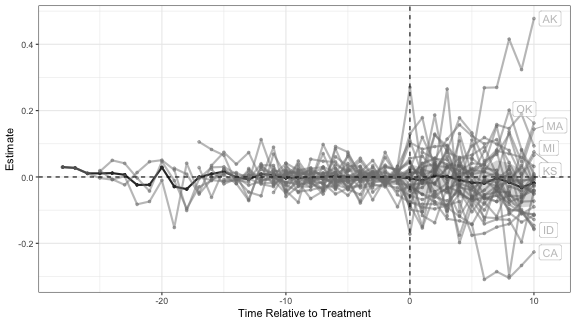
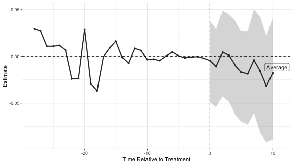
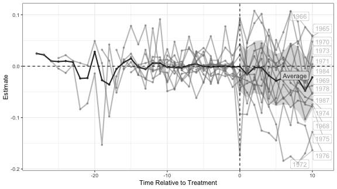
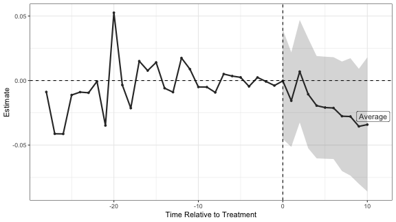

# `augsynth`: Estimating treatment effects with staggered adoption

### The data

To show the features of the `multisynth` function we will use data on the effects of states implementing mandatory collective bargaining agreements for public sector unions [(Paglayan, 2018)](https://onlinelibrary.wiley.com/doi/full/10.1111/ajps.12388)


```r
library(magrittr)
library(dplyr)
library(augsynth)
```


```r
data <- read.csv("https://dataverse.harvard.edu/api/access/datafile/:persistentId?persistentId=doi:10.7910/DVN/WGWMAV/3UHTLP", sep="\t")
```

The dataset contains several important variables that we'll use:

- `year`, `State`: The state and year of the measurement
- `YearCBrequired`: The year that the state adopted mandatory collective bargaining
- `lnppexpend`: Log per pupil expenditures in constant 2010 $

<table class="table table-hover table-responsive" style="margin-left: auto; margin-right: auto;">
 <thead>
  <tr>
   <th style="text-align:right;"> year </th>
   <th style="text-align:left;"> State </th>
   <th style="text-align:right;"> YearCBrequired </th>
   <th style="text-align:right;"> lnppexpend </th>
  </tr>
 </thead>
<tbody>
  <tr>
   <td style="text-align:right;"> 1960 </td>
   <td style="text-align:left;"> AK </td>
   <td style="text-align:right;"> 1970 </td>
   <td style="text-align:right;"> 8.325518 </td>
  </tr>
  <tr>
   <td style="text-align:right;"> 1960 </td>
   <td style="text-align:left;"> AL </td>
   <td style="text-align:right;"> NA </td>
   <td style="text-align:right;"> 7.396177 </td>
  </tr>
  <tr>
   <td style="text-align:right;"> 1960 </td>
   <td style="text-align:left;"> AR </td>
   <td style="text-align:right;"> NA </td>
   <td style="text-align:right;"> 7.385373 </td>
  </tr>
  <tr>
   <td style="text-align:right;"> 1960 </td>
   <td style="text-align:left;"> AZ </td>
   <td style="text-align:right;"> NA </td>
   <td style="text-align:right;"> 7.947127 </td>
  </tr>
  <tr>
   <td style="text-align:right;"> 1960 </td>
   <td style="text-align:left;"> CA </td>
   <td style="text-align:right;"> 1976 </td>
   <td style="text-align:right;"> 8.185162 </td>
  </tr>
  <tr>
   <td style="text-align:right;"> 1960 </td>
   <td style="text-align:left;"> CO </td>
   <td style="text-align:right;"> NA </td>
   <td style="text-align:right;"> 7.952833 </td>
  </tr>
</tbody>
</table>


To run `multisynth`, we need to include a treatment status column that indicates which state is treated in a given year, we call this `cbr` below. We also restrict to the years 1959-1997 where we have yearly measurements of expenditures and drop Washington D.C. and Wisconsin from the analysis.


```r
data %>%
    filter(!State %in% c("DC", "WI"),
           year >= 1959, year <= 1997) %>%
    mutate(YearCBrequired = ifelse(is.na(YearCBrequired), 
                                   Inf, YearCBrequired),
           cbr = 1 * (year >= YearCBrequired)) -> analysis_df
```

## Partially pooled SCM with an intercept

To fit partially pooled synthetic controls, we need to give `multisynth` a formula of the form `outcome ~ treatment`, point it to the unit and time variables, and choose the level of partial pooling `nu`. Setting `nu = 0` fits a separate synthetic control for each treated unit and setting `nu = 1` fits fully pooled synthetic controls. If we don't set `nu`, `multisynth` will choose a heuristic value based on how well separate synthetic controls balance the overall average.
By default, `multisynth` includes an intercept shift along with the weights; we can exclude the intercept shift by setting `fixedeff = F`.
We can also set the number of pre-treatment time periods (lags) that we want to balance with the `n_lags` argument and the number of post-treatment time periods (leads) that we want to estimate with the `n_leads` argument. By default `multisynth` sets `n_lags` and `n_leads` to the number of pre-treatment and post-treatment periods for the last treated unit, respectively.


```r
# with a choice of nu
ppool_syn <- multisynth(lnppexpend ~ cbr, State, year, 
                        nu = 0.5, analysis_df)
# with default nu
ppool_syn <- multisynth(lnppexpend ~ cbr, State, year, 
                        analysis_df)

print(ppool_syn$nu)
#> [1] 0.2606793

ppool_syn
#> 
#> Call:
#> multisynth(form = lnppexpend ~ cbr, unit = State, time = year, 
#>     data = analysis_df)
#> 
#> Average ATT Estimate: -0.011
```

Using the `summary` function, we'll compute the treatment effects and standard errors and confidence intervals for all treated units as well as the average via the wild bootstrap. (This takes a bit of time so we'll store the output) We can also change the significant level associated with the confidence intervals by setting the `alpha` argument, by default `alpha = 0.05`.


```r
ppool_syn_summ <- summary(ppool_syn)
```

We can then report the level of global and individual balance as well as estimates for the average.


```r
ppool_syn_summ
#> 
#> Call:
#> multisynth(form = lnppexpend ~ cbr, unit = State, time = year, 
#>     data = analysis_df)
#> 
#> Average ATT Estimate (Std. Error): -0.011  (0.022)
#> 
#> Global L2 Imbalance: 0.003
#> Scaled Global L2 Imbalance: 0.019
#> Percent improvement from uniform global weights: 98.1
#> 
#> Individual L2 Imbalance: 0.028
#> Scaled Individual L2 Imbalance: 0.096
#> Percent improvement from uniform individual weights: 90.4	
#> 
#>  Time Since Treatment   Level     Estimate  Std.Error lower_bound upper_bound
#>                     0 Average -0.004281754 0.02231379 -0.04888183  0.03786032
#>                     1 Average -0.010856856 0.02099299 -0.05423609  0.02939147
#>                     2 Average  0.004378813 0.02268842 -0.04268354  0.04896627
#>                     3 Average  0.001155346 0.02388535 -0.04846624  0.04464696
#>                     4 Average -0.009305005 0.02529949 -0.06207289  0.03822153
#>                     5 Average -0.016942988 0.02447144 -0.06935946  0.02695179
#>                     6 Average -0.018505173 0.02507329 -0.07297111  0.02755436
#>                     7 Average -0.003866657 0.02817460 -0.06047905  0.05013422
#>                     8 Average -0.015835730 0.03141197 -0.08179055  0.04231137
#>                     9 Average -0.031751350 0.02962989 -0.09168791  0.02202697
#>                    10 Average -0.017839047 0.03314017 -0.08835499  0.04070061
```

`ppool_syn_summ$att` is a dataframe that contains all of the point estimates, standard errors, and lower/upper confidence limits. `Time = NA` denotes the effect averaged across the post treatment periods.

<table class="table table-hover table-responsive" style="margin-left: auto; margin-right: auto;">
 <thead>
  <tr>
   <th style="text-align:right;"> Time </th>
   <th style="text-align:left;"> Level </th>
   <th style="text-align:right;"> Estimate </th>
   <th style="text-align:right;"> Std.Error </th>
   <th style="text-align:right;"> lower_bound </th>
   <th style="text-align:right;"> upper_bound </th>
  </tr>
 </thead>
<tbody>
  <tr>
   <td style="text-align:right;"> 0 </td>
   <td style="text-align:left;"> Average </td>
   <td style="text-align:right;"> -0.0042818 </td>
   <td style="text-align:right;"> 0.0223138 </td>
   <td style="text-align:right;"> -0.0488818 </td>
   <td style="text-align:right;"> 0.0378603 </td>
  </tr>
  <tr>
   <td style="text-align:right;"> 1 </td>
   <td style="text-align:left;"> Average </td>
   <td style="text-align:right;"> -0.0108569 </td>
   <td style="text-align:right;"> 0.0209930 </td>
   <td style="text-align:right;"> -0.0542361 </td>
   <td style="text-align:right;"> 0.0293915 </td>
  </tr>
  <tr>
   <td style="text-align:right;"> 2 </td>
   <td style="text-align:left;"> Average </td>
   <td style="text-align:right;"> 0.0043788 </td>
   <td style="text-align:right;"> 0.0226884 </td>
   <td style="text-align:right;"> -0.0426835 </td>
   <td style="text-align:right;"> 0.0489663 </td>
  </tr>
  <tr>
   <td style="text-align:right;"> 3 </td>
   <td style="text-align:left;"> Average </td>
   <td style="text-align:right;"> 0.0011553 </td>
   <td style="text-align:right;"> 0.0238853 </td>
   <td style="text-align:right;"> -0.0484662 </td>
   <td style="text-align:right;"> 0.0446470 </td>
  </tr>
  <tr>
   <td style="text-align:right;"> 4 </td>
   <td style="text-align:left;"> Average </td>
   <td style="text-align:right;"> -0.0093050 </td>
   <td style="text-align:right;"> 0.0252995 </td>
   <td style="text-align:right;"> -0.0620729 </td>
   <td style="text-align:right;"> 0.0382215 </td>
  </tr>
  <tr>
   <td style="text-align:right;"> 5 </td>
   <td style="text-align:left;"> Average </td>
   <td style="text-align:right;"> -0.0169430 </td>
   <td style="text-align:right;"> 0.0244714 </td>
   <td style="text-align:right;"> -0.0693595 </td>
   <td style="text-align:right;"> 0.0269518 </td>
  </tr>
</tbody>
</table>


We can also visually display both the pre-treatment balance and the estimated treatment effects.


```r
plot(ppool_syn_summ)
```

<div class="figure" style="text-align: center">

<p class="caption">plot of chunk ppool_syn_plot</p>
</div>

And again we can hone in on the average effects.


```r
plot(ppool_syn_summ, levels = "Average")
```

<div class="figure" style="text-align: center">

<p class="caption">plot of chunk ppool_syn_plot_avg</p>
</div>


### Collapsing into time cohorts

We can also collapse treated units with the same treatment time into _time cohorts_, and find one synthetic control per time cohort by setting `time_cohort = TRUE`. When the number of distinct treatment times is much smaller than the number of treated units, this will run significantly faster.


```r
# with default nu
ppool_syn_time <- multisynth(lnppexpend ~ cbr, State, year,
                        analysis_df, time_cohort = TRUE)

print(ppool_syn_time$nu)
#> [1] 0.3939013

ppool_syn_time
#> 
#> Call:
#> multisynth(form = lnppexpend ~ cbr, unit = State, time = year, 
#>     data = analysis_df, time_cohort = TRUE)
#> 
#> Average ATT Estimate: -0.018
```

We can then compute effects for the overall average as well as for each treatment time cohort, rather than individual units.


```r
ppool_syn_time_summ <- summary(ppool_syn_time)
ppool_syn_time_summ
#> 
#> Call:
#> multisynth(form = lnppexpend ~ cbr, unit = State, time = year, 
#>     data = analysis_df, time_cohort = TRUE)
#> 
#> Average ATT Estimate (Std. Error): -0.018  (0.024)
#> 
#> Global L2 Imbalance: 0.005
#> Scaled Global L2 Imbalance: 0.018
#> Percent improvement from uniform global weights: 98.2
#> 
#> Individual L2 Imbalance: 0.038
#> Scaled Individual L2 Imbalance: 0.057
#> Percent improvement from uniform individual weights: 94.3	
#> 
#>  Time Since Treatment   Level      Estimate  Std.Error lower_bound upper_bound
#>                     0 Average -0.0007756959 0.02443902 -0.04849731  0.04410082
#>                     1 Average -0.0160616979 0.02455148 -0.06120905  0.03042719
#>                     2 Average -0.0028471499 0.02521902 -0.05189710  0.04841170
#>                     3 Average -0.0026721191 0.02742973 -0.05634460  0.05048728
#>                     4 Average -0.0181312843 0.02798461 -0.07148111  0.03468573
#>                     5 Average -0.0284898474 0.02644653 -0.07724091  0.02368573
#>                     6 Average -0.0228343778 0.02673115 -0.07456646  0.02837584
#>                     7 Average -0.0140789250 0.03200335 -0.07574649  0.04580312
#>                     8 Average -0.0245472682 0.03276526 -0.08792999  0.03819451
#>                     9 Average -0.0476922268 0.03221486 -0.11080383  0.01490279
#>                    10 Average -0.0216121159 0.03235770 -0.08391841  0.03853317
```

<table class="table table-hover table-responsive" style="margin-left: auto; margin-right: auto;">
 <thead>
  <tr>
   <th style="text-align:right;"> Time </th>
   <th style="text-align:left;"> Level </th>
   <th style="text-align:right;"> Estimate </th>
   <th style="text-align:right;"> Std.Error </th>
   <th style="text-align:right;"> lower_bound </th>
   <th style="text-align:right;"> upper_bound </th>
  </tr>
 </thead>
<tbody>
  <tr>
   <td style="text-align:right;"> 0 </td>
   <td style="text-align:left;"> Average </td>
   <td style="text-align:right;"> -0.0007757 </td>
   <td style="text-align:right;"> 0.0244390 </td>
   <td style="text-align:right;"> -0.0484973 </td>
   <td style="text-align:right;"> 0.0441008 </td>
  </tr>
  <tr>
   <td style="text-align:right;"> 1 </td>
   <td style="text-align:left;"> Average </td>
   <td style="text-align:right;"> -0.0160617 </td>
   <td style="text-align:right;"> 0.0245515 </td>
   <td style="text-align:right;"> -0.0612091 </td>
   <td style="text-align:right;"> 0.0304272 </td>
  </tr>
  <tr>
   <td style="text-align:right;"> 2 </td>
   <td style="text-align:left;"> Average </td>
   <td style="text-align:right;"> -0.0028471 </td>
   <td style="text-align:right;"> 0.0252190 </td>
   <td style="text-align:right;"> -0.0518971 </td>
   <td style="text-align:right;"> 0.0484117 </td>
  </tr>
  <tr>
   <td style="text-align:right;"> 3 </td>
   <td style="text-align:left;"> Average </td>
   <td style="text-align:right;"> -0.0026721 </td>
   <td style="text-align:right;"> 0.0274297 </td>
   <td style="text-align:right;"> -0.0563446 </td>
   <td style="text-align:right;"> 0.0504873 </td>
  </tr>
  <tr>
   <td style="text-align:right;"> 4 </td>
   <td style="text-align:left;"> Average </td>
   <td style="text-align:right;"> -0.0181313 </td>
   <td style="text-align:right;"> 0.0279846 </td>
   <td style="text-align:right;"> -0.0714811 </td>
   <td style="text-align:right;"> 0.0346857 </td>
  </tr>
  <tr>
   <td style="text-align:right;"> 5 </td>
   <td style="text-align:left;"> Average </td>
   <td style="text-align:right;"> -0.0284898 </td>
   <td style="text-align:right;"> 0.0264465 </td>
   <td style="text-align:right;"> -0.0772409 </td>
   <td style="text-align:right;"> 0.0236857 </td>
  </tr>
</tbody>
</table>


Again we can plot the effects.


```r
plot(ppool_syn_time_summ)
```

<div class="figure" style="text-align: center">

<p class="caption">plot of chunk ppool_syn_time_plot</p>
</div>


### Including auxiliary covariates

We can also include an additional set of covariates to balance along with the pre-treatment outcomes. First, let's create a data frame with the values of some covariates in a few different years:


```r

data %>%
  select(State, year, agr, pnwht, purban, perinc, studteachratio) %>%
  group_by(State) %>%
  summarise(perinc_1959 = perinc[year == 1959],
            studteachratio_1959 = studteachratio[year == 1959]) %>% 
  # filter to lower 48 where we have data
  filter(!State %in% c("AK", "HI"))  -> cov_data

analysis_df %>%
  inner_join(cov_data, by = "State") -> analysis_df_covs
```

To include auxiliary covariates, we can add them in to the formula after `|`. This will balance the auxiliary covariates along with the pre-treatment outcomes simultanouesly. If the covariates vary during the pre-treatment periods, `multisynth` will use the average pre-treatment value. We can change this behavior by including our own custom aggregation function via the `cov_agg` argument.

```r
# with default nu
ppool_syn_cov <- multisynth(lnppexpend ~ cbr | perinc_1959 + studteachratio_1959,
                            State, year, analysis_df_covs)

print(ppool_syn_cov$nu)
#> [1] 0.2242633

ppool_syn_cov
#> 
#> Call:
#> multisynth(form = lnppexpend ~ cbr | perinc_1959 + studteachratio_1959, 
#>     unit = State, time = year, data = analysis_df_covs)
#> 
#> Average ATT Estimate: -0.019
```

Again we can compute effects, along with their standard errors and confidence intervals, and plot.

```r
ppool_syn_cov_summ <- summary(ppool_syn_cov)
ppool_syn_cov_summ
#> 
#> Call:
#> multisynth(form = lnppexpend ~ cbr | perinc_1959 + studteachratio_1959, 
#>     unit = State, time = year, data = analysis_df_covs)
#> 
#> Average ATT Estimate (Std. Error): -0.019  (0.016)
#> 
#> Global L2 Imbalance: 0.004
#> Scaled Global L2 Imbalance: 0.030
#> Percent improvement from uniform global weights: 97
#> 
#> Individual L2 Imbalance: 0.043
#> Scaled Individual L2 Imbalance: 0.155
#> Percent improvement from uniform individual weights: 84.5	
#> 
#>  Time Since Treatment   Level      Estimate  Std.Error lower_bound upper_bound
#>                     0 Average -0.0002624529 0.02142663 -0.04534283 0.039477273
#>                     1 Average -0.0156461424 0.01955742 -0.05138329 0.021858933
#>                     2 Average  0.0069387257 0.01979857 -0.03246108 0.046934990
#>                     3 Average -0.0106105517 0.02094953 -0.05241864 0.032678554
#>                     4 Average -0.0194238312 0.02027608 -0.06026658 0.019006295
#>                     5 Average -0.0209126517 0.02065713 -0.06053277 0.018478402
#>                     6 Average -0.0212525401 0.02011174 -0.06076619 0.018093027
#>                     7 Average -0.0276107046 0.02122581 -0.07010144 0.014753050
#>                     8 Average -0.0278450111 0.02282095 -0.07360570 0.017305636
#>                     9 Average -0.0354977043 0.02341366 -0.07998872 0.009126067
#>                    10 Average -0.0341083505 0.02709654 -0.08591161 0.017937928
```

<table class="table table-hover table-responsive" style="margin-left: auto; margin-right: auto;">
 <thead>
  <tr>
   <th style="text-align:right;"> Time </th>
   <th style="text-align:left;"> Level </th>
   <th style="text-align:right;"> Estimate </th>
   <th style="text-align:right;"> Std.Error </th>
   <th style="text-align:right;"> lower_bound </th>
   <th style="text-align:right;"> upper_bound </th>
  </tr>
 </thead>
<tbody>
  <tr>
   <td style="text-align:right;"> 0 </td>
   <td style="text-align:left;"> Average </td>
   <td style="text-align:right;"> -0.0002625 </td>
   <td style="text-align:right;"> 0.0214266 </td>
   <td style="text-align:right;"> -0.0453428 </td>
   <td style="text-align:right;"> 0.0394773 </td>
  </tr>
  <tr>
   <td style="text-align:right;"> 1 </td>
   <td style="text-align:left;"> Average </td>
   <td style="text-align:right;"> -0.0156461 </td>
   <td style="text-align:right;"> 0.0195574 </td>
   <td style="text-align:right;"> -0.0513833 </td>
   <td style="text-align:right;"> 0.0218589 </td>
  </tr>
  <tr>
   <td style="text-align:right;"> 2 </td>
   <td style="text-align:left;"> Average </td>
   <td style="text-align:right;"> 0.0069387 </td>
   <td style="text-align:right;"> 0.0197986 </td>
   <td style="text-align:right;"> -0.0324611 </td>
   <td style="text-align:right;"> 0.0469350 </td>
  </tr>
  <tr>
   <td style="text-align:right;"> 3 </td>
   <td style="text-align:left;"> Average </td>
   <td style="text-align:right;"> -0.0106106 </td>
   <td style="text-align:right;"> 0.0209495 </td>
   <td style="text-align:right;"> -0.0524186 </td>
   <td style="text-align:right;"> 0.0326786 </td>
  </tr>
  <tr>
   <td style="text-align:right;"> 4 </td>
   <td style="text-align:left;"> Average </td>
   <td style="text-align:right;"> -0.0194238 </td>
   <td style="text-align:right;"> 0.0202761 </td>
   <td style="text-align:right;"> -0.0602666 </td>
   <td style="text-align:right;"> 0.0190063 </td>
  </tr>
  <tr>
   <td style="text-align:right;"> 5 </td>
   <td style="text-align:left;"> Average </td>
   <td style="text-align:right;"> -0.0209127 </td>
   <td style="text-align:right;"> 0.0206571 </td>
   <td style="text-align:right;"> -0.0605328 </td>
   <td style="text-align:right;"> 0.0184784 </td>
  </tr>
</tbody>
</table>


Again we can plot the effects.

```r
plot(ppool_syn_cov_summ, levels = "Average")
```

<div class="figure" style="text-align: center">

<p class="caption">plot of chunk ppool_syn_cov_plot</p>
</div>
