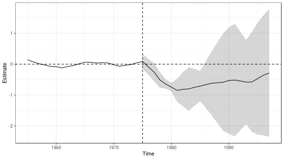
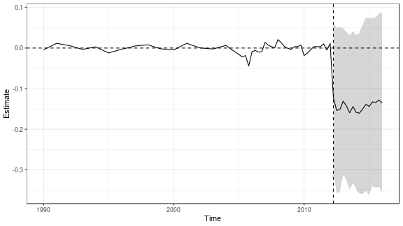

# `augsynth`: The Augmented Synthetic Control Method


## Installation

You can install `augsynth` from github using `devtools`.


```r
## Install devtools if noy already installed
install.packages("devtools", repos='http://cran.us.r-project.org')
## Install augsynth from github
devtools::install_github("ebenmichael/augsynth")
```

## Example: Effects of the 2012 Kansas Tax Cuts 

### The data
To show the usage and features of `augsynth`, we'll use data on the impact of personal income tax cuts in Kansas that comes with the `AugSynth` package. Our interest is in estimating the effect of income tax cuts on gross state product (GSP) per capita.


```r
library(magrittr)
library(dplyr)
library(augsynth)
data(kansas)
```

The `kansas` dataset contains the GSP per capita (the outcome measure) `lngdpcapita` for all 50 states from the first quarter of 1990 to the first quarter of 2016.

To run `augsynth`, we need to include a treatment status column that indicates which region was treated and at what time. The table in `kansas` contains the column `treated` to denote this. In the original study, the second quarter of 2012 was the implementation of the tax cut in Kansas.


```r
kansas %>% select(year, qtr, year_qtr, state, treated, gdp, lngdpcapita) %>% filter(state == "Kansas" & year_qtr >= 2012 & year_qtr < 2013) 
#> # A tibble: 4 x 7
#>    year   qtr year_qtr state  treated    gdp lngdpcapita
#>   <dbl> <dbl>    <dbl> <chr>    <dbl>  <dbl>       <dbl>
#> 1  2012     1    2012  Kansas       0 143844        10.8
#> 2  2012     2    2012. Kansas       1 141518        10.8
#> 3  2012     3    2012. Kansas       1 138890        10.8
#> 4  2012     4    2013. Kansas       1 139603        10.8
```


### Synth
Now to find a synthetic control using the entire series of pre-intervention outcomes (and no auxiliary covariates), we can use `augsynth`. To do so we just need to give `augsynth` a formula like `outcome ~ treatment`, tell it what the unit and time variables are, optionally provide when intervention took place (the code will automatically determine this if `t_int` is not provided), and specify that we don't want to fit an outcome model


```r
library(augsynth)
syn <- augsynth(lngdpcapita ~ treated, fips, year_qtr, kansas,
                progfunc="None", scm=T, t_int = 2012.25)
```

We can then look at the ATT estimates for each post-intervention time period and overall. We'll also see standard errors estimated using leave-out-one estimates of the noise and the quality of the synthetic control fit measured by the L2 distance between Kansas and its synthetic control.


```r
summary(syn)
#> 
#> Call:
#> single_augsynth(form = form, unit = !!enquo(unit), time = !!enquo(time), 
#>     t_int = t_int, data = data, progfunc = "None", scm = ..2)
#> 
#> Average ATT Estimate (Std. Error): -0.029  (0.032)
#> L2 Imbalance: 0.083
#> Scaled L2 Imbalance: 0.205
#> Percent improvement from uniform weights: 79.5%
#> Avg Estimated Bias: NA
#> 
#>     Time    Estimate  Std.Error
#>  2012.25 -0.01807275 0.02522761
#>  2012.50 -0.04105313 0.03005177
#>  2012.75 -0.03310023 0.02843157
#>  2013.00 -0.01940747 0.02380166
#>  2013.25 -0.02915453 0.02192548
#>  2013.50 -0.04626635 0.02652482
#>  2013.75 -0.03181209 0.02187922
#>  2014.00 -0.04476664 0.02783040
#>  2014.25 -0.04267269 0.03299546
#>  2014.50 -0.02940448 0.03382640
#>  2014.75 -0.01849616 0.03720388
#>  2015.00 -0.02930564 0.04226317
#>  2015.25 -0.01908377 0.03571756
#>  2015.50 -0.02162342 0.04012163
#>  2015.75 -0.01856676 0.04249425
#>  2016.00 -0.02816962 0.04896375
```

It's easier to see this information visually. Below we plot the difference between the Basque region and it's synthetic control. Before the increase in terrorism (to the left of the dashed line) we expect these to be close, and after the increase we measure the effect (plus or minus 2 standard errors).


### Augmenting synth with an outcome model
In this example the pre-intervention synthetic control fit has an L2 imbalance of 0.083, about 20% of the imbalance between Kansas and the average of the other states. We can reduce this by _augmenting_ synth with ridge regression. To do this we change `progfunc` to `"Ridge"`. We can also choose the ridge hyper-parameter by setting `lambda`, while not specifying `lambda` will determine one through cross validation:

```r
asyn <- augsynth(lngdpcapita ~ treated, fips, year_qtr, kansas,
                progfunc="Ridge", scm=T)
```

We can look at the summary and plot the results. Now in the summary output we see an estimate of the overall bias of synth; we measure this with the average amount that augmentation changes the synth estimate. Notice that the estimates become somewhat larger in magnitude, and the standard errors are tighter.

```r
summary(asyn)
#> 
#> Call:
#> single_augsynth(form = form, unit = !!enquo(unit), time = !!enquo(time), 
#>     t_int = t_int, data = data, progfunc = "Ridge", scm = ..2)
#> 
#> Average ATT Estimate (Std. Error): -0.040  (0.024)
#> L2 Imbalance: 0.062
#> Scaled L2 Imbalance: 0.153
#> Percent improvement from uniform weights: 84.7%
#> Avg Estimated Bias: 0.011
#> 
#>     Time    Estimate  Std.Error
#>  2012.25 -0.02233432 0.02085981
#>  2012.50 -0.04703842 0.02421257
#>  2012.75 -0.04252002 0.02117116
#>  2013.00 -0.02967474 0.01658453
#>  2013.25 -0.04119699 0.01645880
#>  2013.50 -0.05922698 0.01985558
#>  2013.75 -0.04466913 0.01714846
#>  2014.00 -0.05803598 0.02046732
#>  2014.25 -0.05516412 0.02538454
#>  2014.50 -0.04148561 0.02696688
#>  2014.75 -0.02923219 0.02973763
#>  2015.00 -0.04004239 0.03360558
#>  2015.25 -0.03045080 0.02705158
#>  2015.50 -0.03269061 0.03077540
#>  2015.75 -0.02895347 0.03251924
#>  2016.00 -0.03829085 0.03818993
```


There are also several auxiliary covariates. We can include these in the augmentation by fitting an outcome model using the auxiliary covariates. To do this we simply add the covariates into the formula after `|`; by default this will average the auxiliary covariates over the pre-intervention period, dropping `NA` values and regress out the auxiliary covariates.


```r
covsyn <- augsynth(lngdpcapita ~ treated | lngdpcapita + log(revstatecapita) + log(revlocalcapita) + log(avgwklywagecapita)+ estabscapita + emplvlcapita,
                   fips, year_qtr, kansas,
                   progfunc="None", scm=T)
```

Again we can look at the summary and plot the results.

```r
summary(covsyn)
#> 
#> Call:
#> single_augsynth(form = form, unit = !!enquo(unit), time = !!enquo(time), 
#>     t_int = t_int, data = data, progfunc = "None", scm = ..2)
#> 
#> Average ATT Estimate (Std. Error): -0.049  (0.034)
#> L2 Imbalance: 0.084
#> Scaled L2 Imbalance: 0.208
#> Percent improvement from uniform weights: 79.2%
#> Avg Estimated Bias: NA
#> 
#>     Time    Estimate  Std.Error
#>  2012.25 -0.02341704 0.02405627
#>  2012.50 -0.04839027 0.02750598
#>  2012.75 -0.04001962 0.02832399
#>  2013.00 -0.04032730 0.02828520
#>  2013.25 -0.04554317 0.02859360
#>  2013.50 -0.06155255 0.03103318
#>  2013.75 -0.04385562 0.02897305
#>  2014.00 -0.06145512 0.03411363
#>  2014.25 -0.05834086 0.03682230
#>  2014.50 -0.04452862 0.03893624
#>  2014.75 -0.03782162 0.04074715
#>  2015.00 -0.05702779 0.04134751
#>  2015.25 -0.04549817 0.03815470
#>  2015.50 -0.05448923 0.04309193
#>  2015.75 -0.05459346 0.04578215
#>  2016.00 -0.07126466 0.04855713
```


Now we can additionally fit ridge ASCM on the residuals, look at the summary, and plot the results.

```r
covsyn_aug <- augsynth(lngdpcapita ~ treated | lngdpcapita + log(revstatecapita) + log(revlocalcapita) + log(avgwklywagecapita)+ estabscapita + emplvlcapita,
                   fips, year_qtr, kansas,
                   progfunc="Ridge", scm=T)
```


```r
summary(covsyn_aug)
#> 
#> Call:
#> single_augsynth(form = form, unit = !!enquo(unit), time = !!enquo(time), 
#>     t_int = t_int, data = data, progfunc = "Ridge", scm = ..2)
#> 
#> Average ATT Estimate (Std. Error): -0.161  (0.325)
#> L2 Imbalance: 0.004
#> Scaled L2 Imbalance: 0.011
#> Percent improvement from uniform weights: 98.9%
#> Avg Estimated Bias: 0.087
#> 
#>     Time    Estimate Std.Error
#>  2012.25 -0.03214328 0.1310501
#>  2012.50 -0.02421939 0.1634960
#>  2012.75  0.01892306 0.3852166
#>  2013.00 -0.07550951 0.3548441
#>  2013.25 -0.07349945 0.3113322
#>  2013.50 -0.04971947 0.2678973
#>  2013.75 -0.11817176 0.1913746
#>  2014.00 -0.27776807 0.5577621
#>  2014.25 -0.27398661 0.4631122
#>  2014.50 -0.27158120 0.4948095
#>  2014.75 -0.28223332 0.5564048
#>  2015.00 -0.20567019 0.4494654
#>  2015.25 -0.17205419 0.3922254
#>  2015.50 -0.19262658 0.4024699
#>  2015.75 -0.25507290 0.4540250
#>  2016.00 -0.29837902 0.5259730
```





Finally, we can augment synth with many different outcome models, this is as easy as changing the `progfunc`. For instance, we can augment synth with the generalized synthetic control method `gsynth`.


```r
gsyn <- augsynth(lngdpcapita ~ treated, fips, year_qtr, kansas,
                   progfunc="GSYN", scm=T)
#> Cross-validating ... 
#>  r = 0; sigma2 = 0.00350; IC = -5.65462; MSPE = 0.00038
#>  r = 1; sigma2 = 0.00133; IC = -6.37101; MSPE = 0.00032
#>  r = 2; sigma2 = 0.00069; IC = -6.77498; MSPE = 0.00032
#>  r = 3; sigma2 = 0.00041; IC = -7.04971; MSPE = 0.00023*
#>  r = 4; sigma2 = 0.00030; IC = -7.12819; MSPE = 0.00023
#>  r = 5; sigma2 = 0.00022; IC = -7.19026; MSPE = 0.00022
#> 
#>  r* = 5
```

For the other outcome models we do not (yet) supply standard error estimates.

```r
gsyn_summ <- summary(gsyn)
```

```r
gsyn_summ
#> 
#> Call:
#> single_augsynth(form = form, unit = !!enquo(unit), time = !!enquo(time), 
#>     t_int = t_int, data = data, progfunc = "GSYN", scm = ..2)
#> 
#> Average ATT Estimate (Std. Error): -0.143  (0.1)
#> L2 Imbalance: 0.083
#> Scaled L2 Imbalance: 0.207
#> Percent improvement from uniform weights: 79.3%
#> Avg Estimated Bias: 0.018
#> 
#>     Time   Estimate  Std.Error
#>  2012.25 -0.1226145 0.09192258
#>  2012.50 -0.1539783 0.10203138
#>  2012.75 -0.1512876 0.10131213
#>  2013.00 -0.1309587 0.09021442
#>  2013.25 -0.1426247 0.09119418
#>  2013.50 -0.1595319 0.09466795
#>  2013.75 -0.1441823 0.09340777
#>  2014.00 -0.1586302 0.09509457
#>  2014.25 -0.1605591 0.09931237
#>  2014.50 -0.1500174 0.10427832
#>  2014.75 -0.1386698 0.10694589
#>  2015.00 -0.1441464 0.10840997
#>  2015.25 -0.1325211 0.10343133
#>  2015.50 -0.1340250 0.10525729
#>  2015.75 -0.1282863 0.10653579
#>  2016.00 -0.1356650 0.11115633
```


```r
plot(gsyn)
```



Several other outcome models are available, including general elastic net regression, bayesian structural time series estimation with `CausalImpact`, and matrix completion with `MCPanel`. For each outcome model you can supply an optional set of parameters, see documentation for details.


