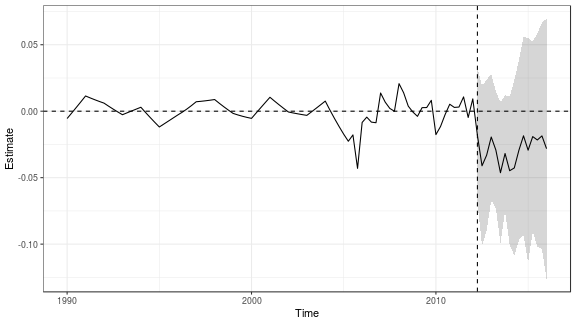
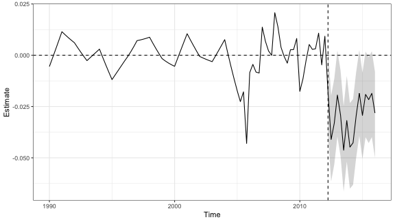
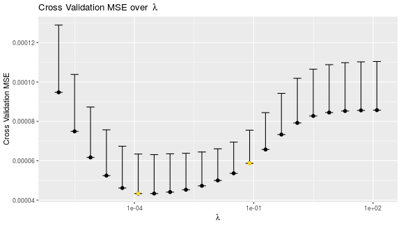
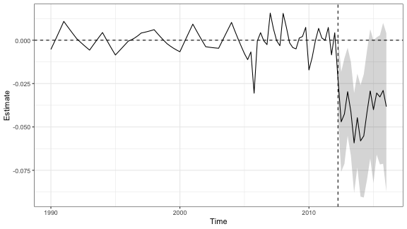
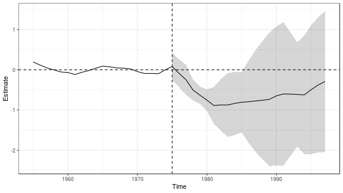
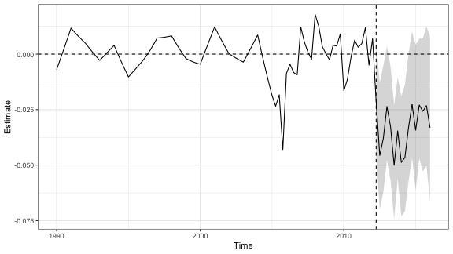

# `augsynth`: The Augmented Synthetic Control Method


## Installation

You can install `augsynth` from github using `devtools`.


```r
## Install devtools if noy already installed
install.packages("devtools", repos='http://cran.us.r-project.org')
## Install augsynth from github
devtools::install_github("ebenmichael/augsynth")
```

## Example: Effects of the 2012 Kansas Tax Cuts 

### The data
To show the usage and features of `augsynth`, we'll use data on the impact of personal income tax cuts in Kansas that comes with the `AugSynth` package. Our interest is in estimating the effect of income tax cuts on gross state product (GSP) per capita.


```r
library(magrittr)
library(dplyr)
library(augsynth)
data(kansas)
```

The `kansas` dataset contains the GSP per capita (the outcome measure) `lngdpcapita` for all 50 states from the first quarter of 1990 to the first quarter of 2016.

To run `augsynth`, we need to include a treatment status column that indicates which region was treated and at what time. The table in `kansas` contains the column `treated` to denote this. In the original study, the second quarter of 2012 was the implementation of the tax cut in Kansas.


```r
kansas %>% 
  select(year, qtr, year_qtr, state, treated, gdp, lngdpcapita) %>% 
  filter(state == "Kansas" & year_qtr >= 2012 & year_qtr < 2013) 
#> # A tibble: 4 x 7
#>    year   qtr year_qtr state  treated    gdp lngdpcapita
#>   <dbl> <dbl>    <dbl> <chr>    <dbl>  <dbl>       <dbl>
#> 1  2012     1    2012  Kansas       0 143844        10.8
#> 2  2012     2    2012. Kansas       1 141518        10.8
#> 3  2012     3    2012. Kansas       1 138890        10.8
#> 4  2012     4    2013. Kansas       1 139603        10.8
```


### Synth
Now to find a synthetic control using the entire series of pre-intervention outcomes (and no auxiliary covariates), we can use `augsynth`. To do so we just need to give `augsynth` a formula like `outcome ~ treatment`, tell it what the unit and time variables are, optionally provide when intervention took place (the code will automatically determine this if `t_int` is not provided), and specify that we don't want to fit an outcome model


```r
library(augsynth)
syn <- augsynth(lngdpcapita ~ treated, fips, year_qtr, kansas,
                progfunc = "None", scm = T)
```

We can then look at the ATT estimates for each post-intervention time period and overall. 
We'll also see the quality of the synthetic control fit measured by the L2 distance between Kansas and its synthetic control, and the percent improvement over uniform weights.
By default, we'll also see pointwise confidence intervals using a [conformal inference procedure](https://arxiv.org/abs/1712.09089).


```r
summary(syn)
#> 
#> Call:
#> single_augsynth(form = form, unit = !!enquo(unit), time = !!enquo(time), 
#>     t_int = t_int, data = data, progfunc = "None", scm = ..2)
#> 
#> Average ATT Estimate (p Value for Joint Null):  -0.029   ( 0.301 )
#> L2 Imbalance: 0.083
#> Percent improvement from uniform weights: 79.5%
#> 
#> Avg Estimated Bias: NA
#> 
#> Inference type: Conformal inference
#> 
#>     Time Estimate 95% CI Lower Bound 95% CI Upper Bound p Value
#>  2012.25   -0.018             -0.045              0.006   0.111
#>  2012.50   -0.041             -0.070             -0.015   0.022
#>  2012.75   -0.033             -0.062             -0.007   0.044
#>  2013.00   -0.019             -0.046              0.005   0.111
#>  2013.25   -0.029             -0.053             -0.005   0.044
#>  2013.50   -0.046             -0.073             -0.022   0.022
#>  2013.75   -0.032             -0.056             -0.010   0.022
#>  2014.00   -0.045             -0.074             -0.018   0.022
#>  2014.25   -0.043             -0.074             -0.014   0.022
#>  2014.50   -0.029             -0.061              0.000   0.044
#>  2014.75   -0.018             -0.053              0.011   0.144
#>  2015.00   -0.029             -0.066              0.005   0.078
#>  2015.25   -0.019             -0.051              0.010   0.122
#>  2015.50   -0.022             -0.056              0.007   0.111
#>  2015.75   -0.019             -0.055              0.013   0.189
#>  2016.00   -0.028             -0.067              0.008   0.100
```


The default test statistic is the sum of the absolute treatment efects `function(x) sum(abs(x))`. We can change the test statistic via the `stat_func` argument. For instance, if we want to perform a one-way test against postive effects, we can set the test stastic to be the negative sum `function(x) -sum(x)`:

```r
summary(syn, stat_func = function(x) -sum(x))
#> 
#> Call:
#> single_augsynth(form = form, unit = !!enquo(unit), time = !!enquo(time), 
#>     t_int = t_int, data = data, progfunc = "None", scm = ..2)
#> 
#> Average ATT Estimate (p Value for Joint Null):  -0.029   ( 0.167 )
#> L2 Imbalance: 0.083
#> Percent improvement from uniform weights: 79.5%
#> 
#> Avg Estimated Bias: NA
#> 
#> Inference type: Conformal inference
#> 
#>     Time Estimate 95% CI Lower Bound 95% CI Upper Bound p Value
#>  2012.25   -0.018             -0.080              0.006   0.067
#>  2012.50   -0.041             -0.103             -0.015   0.022
#>  2012.75   -0.033             -0.095             -0.007   0.033
#>  2013.00   -0.019             -0.081              0.005   0.067
#>  2013.25   -0.029             -0.091             -0.005   0.033
#>  2013.50   -0.046             -0.108             -0.022   0.022
#>  2013.75   -0.032             -0.094             -0.010   0.022
#>  2014.00   -0.045             -0.107             -0.021   0.022
#>  2014.25   -0.043             -0.105             -0.014   0.022
#>  2014.50   -0.029             -0.091              0.000   0.033
#>  2014.75   -0.018             -0.080              0.011   0.078
#>  2015.00   -0.029             -0.091              0.005   0.056
#>  2015.25   -0.019             -0.081              0.007   0.078
#>  2015.50   -0.022             -0.084              0.007   0.067
#>  2015.75   -0.019             -0.081              0.013   0.111
#>  2016.00   -0.028             -0.090              0.008   0.067
```
Or if we want to priotize testing the average post-treatment effect, we can set it to be the absolute sum:

```r
summary(syn, stat_func = function(x) abs(sum(x)))
#> 
#> Call:
#> single_augsynth(form = form, unit = !!enquo(unit), time = !!enquo(time), 
#>     t_int = t_int, data = data, progfunc = "None", scm = ..2)
#> 
#> Average ATT Estimate (p Value for Joint Null):  -0.029   ( 0.324 )
#> L2 Imbalance: 0.083
#> Percent improvement from uniform weights: 79.5%
#> 
#> Avg Estimated Bias: NA
#> 
#> Inference type: Conformal inference
#> 
#>     Time Estimate 95% CI Lower Bound 95% CI Upper Bound p Value
#>  2012.25   -0.018             -0.045              0.006   0.111
#>  2012.50   -0.041             -0.070             -0.015   0.022
#>  2012.75   -0.033             -0.062             -0.007   0.044
#>  2013.00   -0.019             -0.046              0.005   0.111
#>  2013.25   -0.029             -0.053             -0.005   0.044
#>  2013.50   -0.046             -0.073             -0.022   0.022
#>  2013.75   -0.032             -0.056             -0.010   0.022
#>  2014.00   -0.045             -0.074             -0.018   0.022
#>  2014.25   -0.043             -0.074             -0.014   0.022
#>  2014.50   -0.029             -0.061              0.000   0.044
#>  2014.75   -0.018             -0.053              0.011   0.144
#>  2015.00   -0.029             -0.066              0.005   0.078
#>  2015.25   -0.019             -0.051              0.010   0.122
#>  2015.50   -0.022             -0.056              0.007   0.111
#>  2015.75   -0.019             -0.055              0.013   0.189
#>  2016.00   -0.028             -0.067              0.008   0.100
```


It's easier to see this information visually. Below we plot the difference between Kansas and it's synthetic control. Before the tax cuts (to the left of the dashed line) we expect these to be close, and after the tax cuts we measure the effect (with point-wise confidence intervals).


```r
plot(syn)
```



We can also compute point-wise confidence intervals using the [Jackknife+ procedure](https://arxiv.org/abs/1905.02928) by changing the `inf_type` argument, although this requires additional assumptions.


```r
plot(syn, inf_type = "jackknife+")
```




### Augmenting synth with an outcome model
In this example the pre-intervention synthetic control fit has an L2 imbalance of 0.083, about 20% of the imbalance between Kansas and the average of the other states. We can reduce this by _augmenting_ synth with ridge regression. To do this we change `progfunc` to `"Ridge"`. We can also choose the ridge hyper-parameter by setting `lambda`, while not specifying `lambda` will determine one through cross validation:

```r
asyn <- augsynth(lngdpcapita ~ treated, fips, year_qtr, kansas,
                progfunc = "Ridge", scm = T)
```

We can plot the cross-validation MSE when dropping pre-treatment time periods by setting `cv = T` in the `plot` function:


```r
plot(asyn, cv = T)
```



By default, the CV procedure chooses the maximal value of `lambda` with MSE within one standard deviation of the minimal MSE. To instead choose the `lambda` that minizes the cross validation MSE, set `min_1se = FALSE`.


We can look at the summary and plot the results. Now in the summary output we see an estimate of the overall bias of synth; we measure this with the average amount that augmentation changes the synth estimate. Notice that the estimates become somewhat larger in magnitude, and the standard errors are tighter.

```r
summary(asyn)
#> 
#> Call:
#> single_augsynth(form = form, unit = !!enquo(unit), time = !!enquo(time), 
#>     t_int = t_int, data = data, progfunc = "Ridge", scm = ..2)
#> 
#> Average ATT Estimate (p Value for Joint Null):  -0.040   ( 0.078 )
#> L2 Imbalance: 0.062
#> Percent improvement from uniform weights: 84.7%
#> 
#> Avg Estimated Bias: 0.011
#> 
#> Inference type: Conformal inference
#> 
#>     Time Estimate 95% CI Lower Bound 95% CI Upper Bound p Value
#>  2012.25   -0.022             -0.044              0.003   0.056
#>  2012.50   -0.047             -0.076             -0.018   0.022
#>  2012.75   -0.043             -0.071             -0.010   0.022
#>  2013.00   -0.030             -0.055             -0.004   0.033
#>  2013.25   -0.041             -0.067             -0.012   0.022
#>  2013.50   -0.059             -0.088             -0.030   0.022
#>  2013.75   -0.045             -0.073             -0.019   0.022
#>  2014.00   -0.058             -0.090             -0.026   0.022
#>  2014.25   -0.055             -0.091             -0.020   0.022
#>  2014.50   -0.041             -0.080             -0.006   0.033
#>  2014.75   -0.029             -0.068              0.006   0.056
#>  2015.00   -0.040             -0.082              0.000   0.056
#>  2015.25   -0.030             -0.066              0.002   0.056
#>  2015.50   -0.033             -0.072              0.003   0.056
#>  2015.75   -0.029             -0.071              0.010   0.056
#>  2016.00   -0.038             -0.087              0.004   0.056
```


```r
plot(asyn)
```



There are also several auxiliary covariates. We can include these in the augmentation by fitting an outcome model using the auxiliary covariates. To do this we simply add the covariates into the formula after `|`. By default this will create time invariant covariates by averaging the auxiliary covariates over the pre-intervention period, dropping `NA` values. Then the lagged outcomes and the auxiliary covariates are jointly balanced by SCM and the ridge outcome model includes both.


```r
covsyn <- augsynth(lngdpcapita ~ treated | lngdpcapita + log(revstatecapita) +
                                           log(revlocalcapita) + log(avgwklywagecapita) +
                                           estabscapita + emplvlcapita,
                   fips, year_qtr, kansas,
                   progfunc = "ridge", scm = T)
```

Again we can look at the summary and plot the results.

```r
summary(covsyn)
#> 
#> Call:
#> single_augsynth(form = form, unit = !!enquo(unit), time = !!enquo(time), 
#>     t_int = t_int, data = data, progfunc = "ridge", scm = ..2)
#> 
#> Average ATT Estimate (p Value for Joint Null):  -0.061   ( 0.136 )
#> L2 Imbalance: 0.054
#> Percent improvement from uniform weights: 86.6%
#> 
#> Covariate L2 Imbalance: 0.005
#> Percent improvement from uniform weights: 97.7%
#> 
#> Avg Estimated Bias: 0.027
#> 
#> Inference type: Conformal inference
#> 
#>     Time Estimate 95% CI Lower Bound 95% CI Upper Bound p Value
#>  2012.25   -0.021             -0.044              0.002   0.067
#>  2012.50   -0.047             -0.076             -0.014   0.033
#>  2012.75   -0.050             -0.083             -0.007   0.033
#>  2013.00   -0.045             -0.074             -0.012   0.033
#>  2013.25   -0.055             -0.088             -0.022   0.022
#>  2013.50   -0.071             -0.105             -0.033   0.022
#>  2013.75   -0.058             -0.091             -0.025   0.022
#>  2014.00   -0.081             -0.119             -0.037   0.022
#>  2014.25   -0.078             -0.121             -0.034   0.022
#>  2014.50   -0.065             -0.114             -0.021   0.033
#>  2014.75   -0.057             -0.110             -0.008   0.044
#>  2015.00   -0.075             -0.124             -0.022   0.033
#>  2015.25   -0.063             -0.106             -0.014   0.033
#>  2015.50   -0.067             -0.106             -0.019   0.022
#>  2015.75   -0.063             -0.101             -0.009   0.022
#>  2016.00   -0.078             -0.122             -0.019   0.022
```


```r
plot(covsyn)
```



Now we can additionally fit ridge ASCM on the residuals, look at the summary, and plot the results.

```r

covsyn_resid <- augsynth(lngdpcapita ~ treated | lngdpcapita + log(revstatecapita) +
                                           log(revlocalcapita) + log(avgwklywagecapita) +
                                           estabscapita + emplvlcapita,
                   fips, year_qtr, kansas,
                   progfunc = "ridge", scm = T, lambda = asyn$lambda,
                   residualize = T)
```


```r
summary(covsyn_resid)
#> 
#> Call:
#> single_augsynth(form = form, unit = !!enquo(unit), time = !!enquo(time), 
#>     t_int = t_int, data = data, progfunc = "ridge", scm = ..2, 
#>     lambda = ..3, residualize = ..4)
#> 
#> Average ATT Estimate (p Value for Joint Null):  -0.055   ( 0.265 )
#> L2 Imbalance: 0.067
#> Percent improvement from uniform weights: 83.4%
#> 
#> Covariate L2 Imbalance: 0.000
#> Percent improvement from uniform weights: 100%
#> 
#> Avg Estimated Bias: 0.006
#> 
#> Inference type: Conformal inference
#> 
#>     Time Estimate 95% CI Lower Bound 95% CI Upper Bound p Value
#>  2012.25   -0.025             -0.046             -0.005   0.044
#>  2012.50   -0.051             -0.076             -0.026   0.011
#>  2012.75   -0.045             -0.070             -0.020   0.011
#>  2013.00   -0.044             -0.069             -0.019   0.011
#>  2013.25   -0.051             -0.077             -0.026   0.011
#>  2013.50   -0.069             -0.094             -0.044   0.011
#>  2013.75   -0.051             -0.077             -0.026   0.011
#>  2014.00   -0.069             -0.095             -0.040   0.011
#>  2014.25   -0.067             -0.097             -0.037   0.011
#>  2014.50   -0.053             -0.083             -0.024   0.011
#>  2014.75   -0.045             -0.075             -0.015   0.022
#>  2015.00   -0.064             -0.093             -0.034   0.011
#>  2015.25   -0.051             -0.076             -0.026   0.011
#>  2015.50   -0.059             -0.089             -0.034   0.011
#>  2015.75   -0.058             -0.087             -0.028   0.011
#>  2016.00   -0.074             -0.103             -0.044   0.011
```


```r
plot(covsyn_resid)
```


Finally, we can augment synth with many different outcome models. The simplest outcome model is a unit fixed effect model, which we can include by setting `fixedeff = T`.

```r

desyn <- augsynth(lngdpcapita ~ treated,
                   fips, year_qtr, kansas,
                   progfunc = "none", scm = T,
                   fixedeff = T)
```


```r
summary(desyn)
#> 
#> Call:
#> single_augsynth(form = form, unit = !!enquo(unit), time = !!enquo(time), 
#>     t_int = t_int, data = data, progfunc = "none", scm = ..2, 
#>     fixedeff = ..3)
#> 
#> Average ATT Estimate (p Value for Joint Null):  -0.034   ( 0.307 )
#> L2 Imbalance: 0.082
#> Percent improvement from uniform weights: 55.1%
#> 
#> Avg Estimated Bias: NA
#> 
#> Inference type: Conformal inference
#> 
#>     Time Estimate 95% CI Lower Bound 95% CI Upper Bound p Value
#>  2012.25   -0.022             -0.046              0.006   0.078
#>  2012.50   -0.046             -0.070             -0.013   0.022
#>  2012.75   -0.038             -0.062             -0.005   0.044
#>  2013.00   -0.024             -0.048              0.003   0.078
#>  2013.25   -0.033             -0.057             -0.006   0.044
#>  2013.50   -0.050             -0.074             -0.023   0.022
#>  2013.75   -0.035             -0.056             -0.010   0.022
#>  2014.00   -0.049             -0.073             -0.019   0.022
#>  2014.25   -0.047             -0.071             -0.014   0.022
#>  2014.50   -0.033             -0.057              0.000   0.056
#>  2014.75   -0.023             -0.047              0.010   0.122
#>  2015.00   -0.034             -0.061              0.004   0.078
#>  2015.25   -0.023             -0.047              0.007   0.100
#>  2015.50   -0.026             -0.053              0.007   0.100
#>  2015.75   -0.023             -0.050              0.012   0.144
#>  2016.00   -0.033             -0.066              0.008   0.089
```


```r
plot(desyn)
```



We can incorproate other outcome models by changing the `progfunc`.
Several outcome models are available, including, fitting the factor model directly with `gsynth`, general elastic net regression, bayesian structural time series estimation with `CausalImpact`, and matrix completion with `MCPanel`. For each outcome model you can supply an optional set of parameters, see documentation for details.


